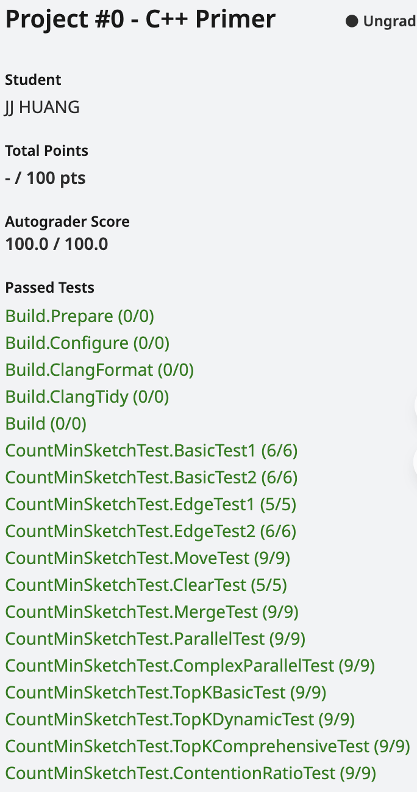

# Count-Min Sketch Implementation Notes



## Project Overview
Implementation of CMU 15-445 (2025 Fall) Project 0 - Count-Min Sketch data structure, a probabilistic data structure for estimating element frequencies.

## Issues Encountered and Solutions

### 1. Constructor Implementation Issues

**Problems:**
- Incorrectly used local variable `table_` instead of member variable
- Missing exception throwing, only had assert

**Solutions:**
```cpp
// Add member variable in header
// Use atomic<uint32_t> to pass the final test (speedup ratio > 1.2)
std::vector<std::vector<std::atomic<uint32_t>>> table_;
```
```cpp
if (width_ == 0 || depth_ == 0) {
  throw std::invalid_argument("Width and depth must be larger than zero.");
}
```

### 2. Lambda Capture Issues in Move Constructor/Assignment

**Problem:**
- Lambdas in `hash_functions_` captured `this` pointer

**Solution:**
Don't directly move `hash_functions_`, regenerate them in the new object:
```cpp
// Wrong approach
hash_functions_ = std::move(other.hash_functions_);

// Correct approach
hash_functions_.clear();
hash_functions_.reserve(depth_);
for (size_t i = 0; i < depth_; i++) {
  hash_functions_.push_back(this->HashFunction(i));
}
```

### 3. Self-Assignment Check in Move Assignment

**Problem:**
Missing self-assignment check

**Solution:**
```cpp
if (this == &other) {
  return *this;
}
```

### 4. Thread-Safety Requirements

**Requirement:**
Insert function must be thread-safe with performance achieving >1.2x speedup

**Approach Comparison:**

❌ **Global Mutex (Poor):**
```cpp
std::mutex page_lock;
std::lock_guard<std::mutex> lock(page_lock);
```
- Issue: Excessive contention, cannot meet performance requirements

✅ **Atomic Operations (Best):**
```cpp
std::vector<std::vector<std::atomic<uint32_t>>> table_;

// Used in Insert
table_[i][hash]++;  // atomic increment
```
- Lock-free, best performance
- But requires careful initialization

### 5. Compatibility Issues Between `std::atomic` and `std::vector`

**Problem:**
`std::atomic` is neither copyable nor movable, causing `vector::resize()` compilation failure

**Error Messages:**
```
static assertion failed: The specified type does not meet the requirements of Cpp17MoveInsertable
call to implicitly-deleted copy constructor of 'std::atomic<unsigned int>'
```

**Solution:**
Don't use `resize()`, use `emplace_back()` for direct construction:

```cpp
// Wrong approach
table_.resize(depth_);
for (size_t i = 0; i < depth; i++) {
  table_[i].resize(width_);  // Compilation fails
}

// Correct approach
for (size_t i = 0; i < depth_; i++) {
  table_.emplace_back(width_);  // Directly construct width_ atomic elements
}
```

### 6. Correct Usage of Atomic Operations

**Read operation:**
```cpp
uint32_t value = table_[i][j].load();
```

**Write operation:**
```cpp
table_[i][j].store(0);
```

**Increment operation:**
```cpp
table_[i][j]++;  // Automatically atomic
```

**Addition operation:**
```cpp
table_[i][j] += other.table_[i][j].load();
```

### 7. TopK Implementation Considerations

**Problem:**
Need to handle sorting stability when counts are equal

**Solution:**
Use vector + sort, or priority_queue (min_heap), both work:
```cpp
std::vector<std::pair<KeyType, uint32_t>> res;
for (auto c: candidates) {
  uint32_t cnt = Count(c);
  res.push_back({c, cnt});
}

std::sort(res.begin(), res.end(),
          [](auto& a, auto& b) {
            if (a.second != b.second) return a.second > b.second;
            return a.first < b.first;
          });

// Take top k elements
std::vector<std::pair<KeyType, uint32_t>> ans;
for (size_t i = 0; i < std::min((size_t)k, res.size()); i++) {
  ans.push_back(res[i]);
}
```

## Important Notes

### C++ Language Features
1. **`this` pointer in Move semantics**: After lambda captures `this`, move doesn't update the captured pointer
2. **`std::atomic` limitations**: Neither copyable nor movable, requires special initialization for vectors
3. **`std::exchange`**: Safely exchanges values and returns old value, useful for move assignment
4. **`emplace_back` vs `resize`**: For non-movable types, must use `emplace_back` for direct construction

### Thread-Safety Strategies
1. **Coarse-grained locking**: Simple but poor performance
2. **Fine-grained locking**: Moderate complexity, moderate performance
3. **Lock-free (Atomic operations)**: Implementation requires attention to details, best performance

### Compilation and Testing
1. Remember to rebuild after code changes: `make count_min_sketch_test`

## Key Learnings
1. Pitfalls in move semantics: lambda capture and object lifetime
2. Correct usage and limitations of atomic operations
3. Choosing appropriate thread-safety strategies to balance performance and complexity
4. Requirements of C++ STL containers on element types (copyable, movable, etc.)

---

# Count-Min Sketch Implementation Notes (中文版)

## 專案概述
實作 CMU 15-445 (2025 Fall) Project 0 - Count-Min Sketch 資料結構，這是一個機率型資料結構，用於估計元素出現次數。

## 遇到的問題與解決方案

### 1. Constructor 實作問題

**問題：**
- 錯誤使用局部變數 `table_` 而非成員變數
- 缺少異常拋出，只有 assert

**解決方案：**
```cpp
// 新增成員變數於header
// 使用atomic<uint32_t>以通過最後一個測試（相對加速比 > 1.2）
std::vector<std::vector<std::atomic<uint32_t>>> table_;
```
```cpp
if (width_ == 0 || depth_ == 0) {
  throw std::invalid_argument("Width and depth must be larger than zero.");
}
```

### 2. Move Constructor/Assignment 的 Lambda 捕獲問題

**問題：**
- `hash_functions_` 中的 lambda 捕獲了 `this` 指標

**解決方案：**
不要直接 move `hash_functions_`，而是在新物件中重新生成：
```cpp
// 錯誤做法
hash_functions_ = std::move(other.hash_functions_);

// 正確做法
hash_functions_.clear();
hash_functions_.reserve(depth_);
for (size_t i = 0; i < depth_; i++) {
  hash_functions_.push_back(this->HashFunction(i));
}
```

### 3. Move Assignment 自我賦值檢查

**問題：**
缺少自我賦值檢查

**解決方案：**
```cpp
if (this == &other) {
  return *this;
}
```

### 4. Thread-Safety 需求

**需求：**
Insert 函數必須是 thread-safe，且效能需達到 >1.2x speedup

**方案比較：**

❌ **全域 Mutex（不佳）：**
```cpp
std::mutex page_lock;
std::lock_guard<std::mutex> lock(page_lock);
```
- 問題：競爭過於激烈，無法達到效能需求

✅ **Atomic Operations（最佳）：**
```cpp
std::vector<std::vector<std::atomic<uint32_t>>> table_;

// Insert 中使用
table_[i][hash]++;  // atomic increment
```
- Lock-free，效能最佳
- 但需注意初始化問題

### 5. `std::atomic` 與 `std::vector` 的相容性問題

**問題：**
`std::atomic` 不可複製、不可移動，導致 `vector::resize()` 編譯失敗

**錯誤訊息：**
```
static assertion failed: The specified type does not meet the requirements of Cpp17MoveInsertable
call to implicitly-deleted copy constructor of 'std::atomic<unsigned int>'
```

**解決方案：**
不使用 `resize()`，改用 `emplace_back()` 直接構造：

```cpp
// 錯誤做法
table_.resize(depth_);
for (size_t i = 0; i < depth; i++) {
  table_[i].resize(width_);  // 編譯失敗
}

// 正確做法
for (size_t i = 0; i < depth_; i++) {
  table_.emplace_back(width_);  // 直接構造 width_ 個 atomic 元素
}
```

### 6. Atomic 操作的正確使用

**讀取操作：**
```cpp
uint32_t value = table_[i][j].load();
```

**寫入操作：**
```cpp
table_[i][j].store(0);
```

**遞增操作：**
```cpp
table_[i][j]++;  // 自動是 atomic 的
```

**加法操作：**
```cpp
table_[i][j] += other.table_[i][j].load();
```

### 7. TopK 實作考量

**問題：**
需要處理 count 相同時的排序穩定性

**解決方案：**
使用 vector + sort，或 priority_queue (min_heap) 皆可：
```cpp
std::vector<std::pair<KeyType, uint32_t>> res;
for (auto c: candidates) {
  uint32_t cnt = Count(c);
  res.push_back({c, cnt});
}

std::sort(res.begin(), res.end(),
          [](auto& a, auto& b) {
            if (a.second != b.second) return a.second > b.second;
            return a.first < b.first;
          });

// 取前 k 個
std::vector<std::pair<KeyType, uint32_t>> ans;
for (size_t i = 0; i < std::min((size_t)k, res.size()); i++) {
  ans.push_back(res[i]);
}
```

## 重要注意事項

### C++ 語言特性
1. **Move semantics 中的 `this` 指標**：lambda 捕獲 `this` 後，move 不會更新捕獲的指標
2. **`std::atomic` 限制**：不可複製、不可移動，需使用特殊方式初始化 vector
3. **`std::exchange`**：安全地交換值並返回舊值，適用於 move assignment
4. **`emplace_back` vs `resize`**：對於不可移動的類型，必須使用 `emplace_back` 直接構造

### Thread-Safety 策略
1. **粗粒度鎖（Coarse-grained locking）**：簡單但效能差
2. **細粒度鎖（Fine-grained locking）**：複雜度中等，效能中等
3. **Lock-free（Atomic operations）**：實作需注意細節，但效能最佳

### 編譯與測試
1. 修改程式碼後記得重新 build：`make count_min_sketch_test`

## 學習重點
1. Move semantics 的陷阱：lambda 捕獲與物件生命週期
2. Atomic operations 的正確使用與限制
3. 選擇合適的 thread-safety 策略以平衡效能與複雜度
4. C++ STL 容器對元素類型的要求（copyable, movable 等）
