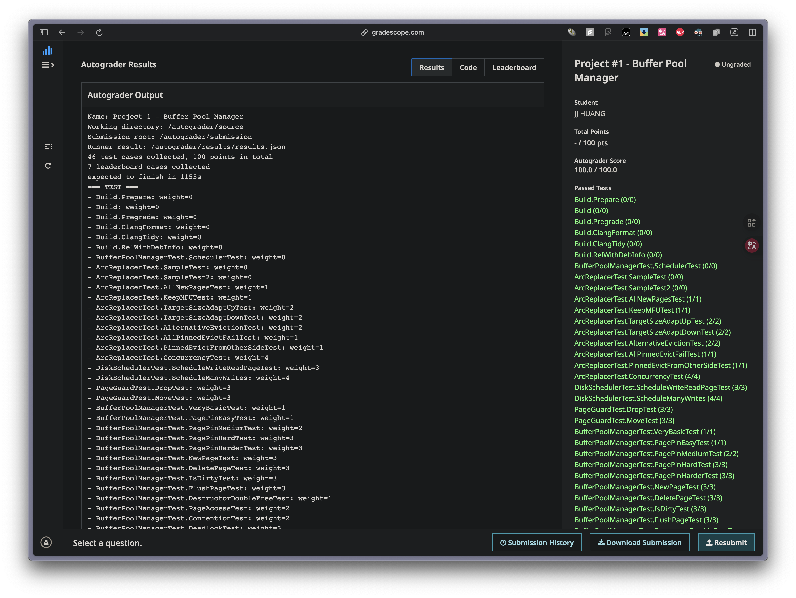

# DiskScheduler Implementation Notes

## Project Overview
Implementation of CMU 15-445 (2025 Fall) Project 1 Task #2 - DiskScheduler, a component that schedules read/write operations on the DiskManager using a background worker thread.




---

## Core Concepts

### 1. Producer-Consumer Pattern

**Architecture:**
```
Main Thread(s)           Background Worker Thread
    |                            |
    | Schedule(requests)         |
    |------------------------->  |
    | Put to request_queue_      |
    |                            | Get from request_queue_
    |                            | Process DiskRequest
    |                            | Call DiskManager I/O
    | future.get() (blocked)     |
    |                            | promise.set_value(true)
    | <------------------------- |
    | (unblocked, continue)      |
```

**Key Components:**
- `Channel<std::optional<DiskRequest>>`: Thread-safe queue for request sharing
- `std::promise<bool>`: Callback mechanism for completion notification
- `std::future<bool>`: Waiting mechanism for request issuer

### 2. Channel Class Behavior

| Method | Behavior | Thread-Safety |
|--------|----------|---------------|
| `Put(element)` | Add to queue, wake all waiting threads | Mutex-protected |
| `Get()` | Block until queue not empty, return front element | Condition variable wait |

**Key Points:**
- `Get()` automatically loops if condition fails after waking up
- Lock auto-released via RAII when `unique_lock` goes out of scope
- `notify_all()` wakes all consumer threads after adding element

### 3. Promise-Future Mechanism

**Flow:**
1. Request issuer creates promise and gets its future
2. Promise moved into DiskRequest
3. Background worker gets request with promise
4. After processing, worker calls `promise.set_value(true)`
5. Future on issuer side unblocks and returns value

**Why This Works:**
- Promise-Future pair provides one-time communication channel
- Future blocks until promise is fulfilled
- Allows async notification without busy-waiting

### 4. Graceful Shutdown Pattern

**Using `std::optional` as "Poison Pill":**
- Destructor sends `std::nullopt` to signal shutdown
- Worker thread checks `has_value()` on received request
- Returns from worker loop when receiving `nullopt`
- Background thread automatically joined in destructor

---

## Implementation Logic

### Schedule() Function
**Purpose:** Add requests to queue for background worker

**Steps:**
1. For each request in vector
2. Wrap in `std::optional` (use `std::make_optional`)
3. Put into request_queue_ (use `std::move`)
4. Worker thread automatically notified by Channel

### StartWorkerThread() Function
**Purpose:** Background worker loop processing scheduled requests

**Steps:**
1. Loop: Get optional request from queue
2. If nullopt → return (shutdown)
3. Extract DiskRequest from optional
4. If write → call WritePage, else ReadPage
5. Set callback promise to true (notify completion)

### Thread Lifecycle

| Phase | Action |
|-------|--------|
| Constructor | Spawn background thread calling StartWorkerThread() |
| Runtime | Background thread continuously processes queue |
| Destructor | Put `std::nullopt` to signal shutdown, join thread |

---

## Key Implementation Points

### 1. Thread-Safety
- Channel class handles all synchronization
- No additional locks needed in Schedule() or StartWorkerThread()
- Multiple threads can safely call Schedule() concurrently

### 2. RAII Benefits
- `std::unique_lock` auto-releases mutex on scope exit
- Background thread auto-joined in destructor
- No manual resource cleanup needed

### 3. Move Semantics
- DiskRequest contains non-copyable `std::promise`
- Must use `std::move()` when putting into vector/queue
- Promises can only be moved, never copied

### 4. Common Issues

| Issue | Cause | Solution |
|-------|-------|----------|
| Type mismatch: DiskRequest vs optional | Queue expects `std::optional<DiskRequest>` | Wrap with `std::make_optional(std::move(r))` |
| Copy constructor deleted | Promise is non-copyable | Always use `std::move()` on DiskRequest |
| Checking optional for empty | Need idiomatic check | Use `!req.has_value()` instead of `== std::nullopt` |
| Accessing optional content | Two ways to access | Use `req->member` or `(*req).member` |

### 5. Type Conversion Pattern

**Wrong:**
```cpp
request_queue_.Put(r);  // Type mismatch
```

**Correct:**
```cpp
request_queue_.Put(std::make_optional(std::move(r)));
```

---
---

# DiskScheduler Implementation Notes (中文版)

## 專案概述
實作 CMU 15-445 (2025 Fall) Project 1 Task #2 - DiskScheduler，負責使用背景工作執行緒排程 DiskManager 的讀寫操作。

---

## 核心概念

### 1. Producer-Consumer 模式

**架構：**
```
主執行緒(s)               背景工作執行緒
    |                            |
    | Schedule(requests)         |
    |------------------------->  |
    | Put 到 request_queue_      |
    |                            | 從 request_queue_ Get
    |                            | 處理 DiskRequest
    |                            | 呼叫 DiskManager I/O
    | future.get() (阻塞中)       |
    |                            | promise.set_value(true)
    | <------------------------- |
    | (解除阻塞，繼續執行)          |
```

**關鍵元件：**
- `Channel<std::optional<DiskRequest>>`：Thread-safe 的請求共享佇列
- `std::promise<bool>`：完成通知的 callback 機制
- `std::future<bool>`：請求發出者的等待機制

### 2. Channel 類別行為

| 方法 | 行為 | 執行緒安全 |
|------|------|-----------|
| `Put(element)` | 加入佇列，喚醒所有等待執行緒 | Mutex 保護 |
| `Get()` | 阻塞直到佇列非空，返回前端元素 | Condition variable 等待 |

**關鍵重點：**
- `Get()` 若喚醒後條件不滿足會自動循環等待
- 鎖透過 RAII 在 `unique_lock` 離開作用域時自動釋放
- `notify_all()` 在加入元素後喚醒所有消費者執行緒

### 3. Promise-Future 機制

**流程：**
1. Request issuer 建立 promise 並取得其 future
2. Promise 被移動到 DiskRequest 中
3. 背景工作者取得包含 promise 的 request
4. 處理完成後，工作者呼叫 `promise.set_value(true)`
5. Issuer 端的 future 解除阻塞並返回值

**為何有效：**
- Promise-Future 對提供單次通訊管道
- Future 阻塞直到 promise 被滿足
- 允許非同步通知而無需 busy-waiting

### 4. 優雅關閉模式

**使用 `std::optional` 作為「毒藥丸」：**
- Destructor 發送 `std::nullopt` 以發出關閉信號
- Worker thread 檢查收到的 request 的 `has_value()`
- 收到 `nullopt` 時從 worker loop 返回
- 背景執行緒在 destructor 中自動被 join

---

## 實作邏輯

### Schedule() 函數
**目的：** 將請求加入佇列供背景工作者處理

**步驟：**
1. 對於 vector 中的每個 request
2. 用 `std::optional` 包裝（使用 `std::make_optional`）
3. Put 到 request_queue_（使用 `std::move`）
4. Worker thread 由 Channel 自動通知

### StartWorkerThread() 函數
**目的：** 背景工作循環處理排程的請求

**步驟：**
1. 循環：從佇列取得 optional request
2. 若為 nullopt → return（關閉）
3. 從 optional 中提取 DiskRequest
4. 若為寫入 → 呼叫 WritePage，否則 ReadPage
5. 設定 callback promise 為 true（通知完成）

### 執行緒生命週期

| 階段 | 動作 |
|------|------|
| Constructor | 產生背景執行緒呼叫 StartWorkerThread() |
| 執行期間 | 背景執行緒持續處理佇列 |
| Destructor | Put `std::nullopt` 發出關閉信號，join 執行緒 |

---

## 關鍵實作要點

### 1. 執行緒安全
- Channel 類別處理所有同步問題
- Schedule() 或 StartWorkerThread() 中不需要額外的鎖
- 多個執行緒可以安全地同時呼叫 Schedule()

### 2. RAII 優勢
- `std::unique_lock` 離開作用域時自動釋放 mutex
- 背景執行緒在 destructor 中自動 join
- 不需要手動清理資源

### 3. Move 語意
- DiskRequest 包含不可複製的 `std::promise`
- 放入 vector/queue 時必須使用 `std::move()`
- Promise 只能移動，不能複製

### 4. 常見問題

| 問題 | 原因 | 解決方案 |
|------|------|---------|
| 型別不匹配：DiskRequest vs optional | 佇列期望 `std::optional<DiskRequest>` | 用 `std::make_optional(std::move(r))` 包裝 |
| Copy constructor deleted | Promise 不可複製 | 總是對 DiskRequest 使用 `std::move()` |
| 檢查 optional 是否為空 | 需要慣用檢查 | 使用 `!req.has_value()` 而非 `== std::nullopt` |
| 存取 optional 內容 | 兩種存取方式 | 使用 `req->member` 或 `(*req).member` |

### 5. 型別轉換模式

**錯誤：**
```cpp
request_queue_.Put(r);  // 型別不匹配
```

**正確：**
```cpp
request_queue_.Put(std::make_optional(std::move(r)));
```
