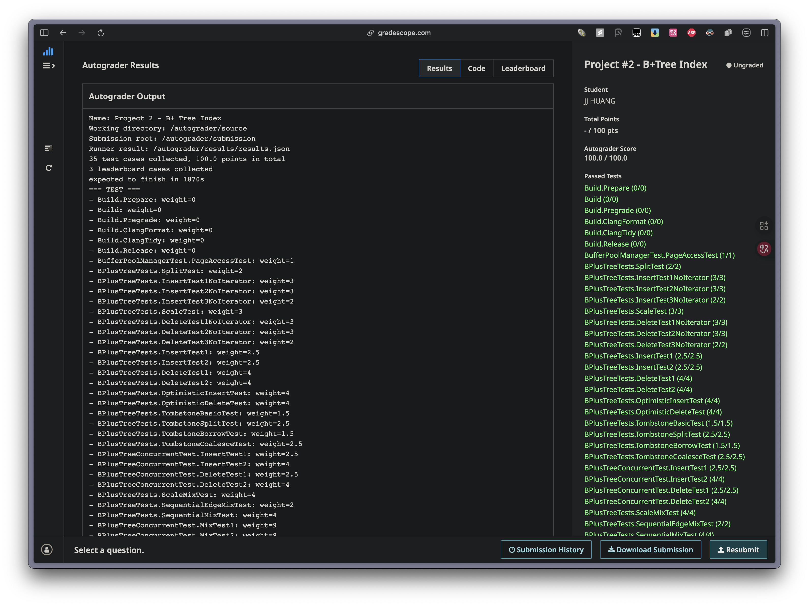

# CMU 15-445 Project 2: B+ Tree Index - Implementation Notes (English)




## Task 1
### Base Page
When do we need SetSize()?
- When initializing a new page (size = 0)
- When reading a page from disk (need to restore the previous size)
- Directly set the new size after split/merge operations

SetSize()
- If the B+Tree implementation is correct, there won't be an opportunity to pass in size > max_size_
- Set directly, no need to check

ChangeSizeBy()
- Need to check upper bound (size_ + amount <= max_size_) and lower bound (size_ + amount >= 0)

Root Page
- BPlusTreePage is the content/data structure of a page
- Page is the unit managed by BufferPoolManager, which has a page_id
- BPlusTree is a higher-level structure that manages the entire tree
- B+Tree has a root_page_id
- The logic to determine if it's a root is in BPlusTree (knows root_page_id and can get the current operating page_id)

GetMinSize()
- Whether to consider the root case is not executed here, but in B+Tree

### Internal Page
- A child doesn't need to know "who is my parent"
- But split and merge require parent information, but at that time we are operating on that parent
- Keys are stored in key_array_; child pointers are stored in page_id_array_, storing not actual pointers but page_ids
- Both key_array_ and page_id_array_ are fixed-size C-style arrays

### Leaf Node
- rid.h: record id (Physical Location)
    - Get() -> return record id (64 bit)
    - GetPageId -> return page_id of the record
    - GetSlotNum -> return which slot number is that record id at
- rid_array_ stores record_ids, which are physical data storage locations
- Init(): SetNextPageId(INVALID_PAGE_ID)

#### Heap Buffer Overflow Issue
- **Problem Description**: When running `BPlusTreeConcurrentTest.remove_posMixTest2`, an AddressSanitizer error occurred: `heap-buffer-overflow`.
- **Root Cause Analysis**:
    - The `BPlusTreeLeafPage` class added `high_key_` and `has_high_key_` member variables, originally intended for Blink-Tree concurrent split detection.
    - The `LEAF_PAGE_SLOT_CNT` macro definition calculates available page space by only subtracting the size of header and tombstones, **without subtracting the size of the newly added `high_key_` related variables**.
    - This causes the calculated slot count to be excessive, making the total size of `key_array_` and `rid_array_` exceed the actual available space of the page (BUSTUB_PAGE_SIZE).
    - When accessing elements at the end of the array, writes occur outside the memory block allocated to the page, triggering heap buffer overflow.
- **Solution**:
    - Since the current B+ Tree implementation doesn't rely on the `high_key` mechanism (uses latch coupling/crabbing), these variables are redundant.
    - Safely removed the `high_key_`, `has_high_key_` member variables and related `HasHighKey`, `GetHighKey`, `SetHighKey` functions from `src/include/storage/page/b_plus_tree_leaf_page.h`.
    - Also updated the `Init` function in `src/storage/page/b_plus_tree_leaf_page.cpp` to remove initialization of `has_high_key_`.
    - After removal, the `LEAF_PAGE_SLOT_CNT` calculation correctly reflects the page layout again, resolving the overflow issue.

## Task 2
### Logic
Merge: size < min_size, need to consider merging
       or, when size >= min_size, do nothing

### B+Tree
```C++
// constructor
WritePageGuard guard = bpm_->WritePage(header_page_id_);
auto root_page = guard.AsMut<BPlusTreeHeaderPage>();
root_page->root_page_id_ = INVALID_PAGE_ID;
```
- bpm_->WritePage(header_page_id_)
    - Get the page with page_id equal to header_page_id_ from the buffer pool
    - Apply write lock to this page (because we want to modify it)
    - Return a WritePageGuard object (lock wrapper)
- auto root_page = guard.AsMut<BPlusTreeHeaderPage>()
    - Convert the page's raw data (char* data) to BPlusTreeHeaderPage* type
- Overall logic:
    1. Get header page (with write lock)
    2. Interpret it as BPlusTreeHeaderPage structure
    3. Set initial root_page_id to INVALID_PAGE_ID (indicating empty tree)
    4. When guard goes out of scope, automatically unlock and unpin

- IsEmpty(): Also need to get header page, but just to get root_page_id and compare with INVALID_PAGE_ID
- GetValue()
    - Should not assume root is always an internal page

### Insert()
- Concept:
    - Leaf page: all keys are valid, starting from index 0
    - Internal page: first key (index 0) is invalid, real keys start from index 1
- Check if there's a value at the insert position: use size_ not rid_array_ initial value
- Check if full before insertion: l+1 < GetMaxSize()
- After simple insertion, update size: ChangeSizeBy(1)

#### PageGuard Usage Issues
- PageGuard is not copyable, only movable
    ```cpp
    ctx.write_set_.push_back(std::move(guard));
    ```
- After moving, original guard is invalid, use ctx.write_set_.back() to access
- Use AsMut<>() when modifying, use As<>() for read-only

#### SplitLeaf()
- Parameters: old_leaf, key, value
- Returns: {sibling_key, sibling_page_id}
- Flow:
    1. Create new sibling page and Init(leaf_max_size_)
    2. Create temp vector to store all max_size+1 elements
    3. Sort temp vector
    4. Put first half back to old_leaf, second half to sibling
    5. Update both sizes
    6. Set old_leaf->SetNextPageId(sibling_page_id)
    7. Return sibling->KeyAt(0) (leaf page all keys are valid)

#### Handling Insert After Split
- Leaf is root (write_set_.size() == 1):
    1. Create new internal root
    2. SetValueAt(0, old_root_page_id)
    3. SetKeyAt(1, sibling_key), SetValueAt(1, sibling_page_id)
    4. Update header page's root_page_id
- Leaf has parent:
    - parent = write_set_[size - 2]
    - Parent has space:
        1. Find insert position (compare starting from index 1)
        2. Move elements to make space
        3. Insert (sibling_key, sibling_page_id) not (key, value)
        4. ChangeSizeBy(1)
    - Parent is also full: need SplitInternal()

#### SplitInternal()
- Example
```c++
[invalid, *P0, 1, *P1, 3, *P2, 4, *P3]  // [1, 2, 4], full
// K0      V0  K1  V1  K2  V2  K3  V3
/*
first_child = *P0
temp = [(1, *P1), (3, *P2), (4, *P3)] -insert-> [(1, *P1), (2, *new), (3, *P2), (4, *P3)]
temp_size = 4, mid = 2
old_internal = [invalid, *P0, 1, *P1, 2, *P_new]
sibling = [invalid, *P2, 4, *P3]
3 is pushed up
return {3, sibling_page_id}
*/
```

#### Optimistic Insert
- **Purpose**: Reduce write operations, only use write locks when necessary. Some tests must use optimistic insert
- **Strategy**:
    1. Traverse down to leaf with read locks
    2. If leaf has space: upgrade to write lock and insert (only write 1 page)
    3. If leaf is full: return std::nullopt, fallback to pessimistic insert
- **Logic (pseudocode)**:
    1. Get root_page_id
    2. Use while to traverse
    3. Start from root_page, acquire read lock
        - If root_page is LeafPage
            - Check if this LeafPage has space, if yes, drop read lock, acquire write lock
            - After acquiring write lock, use AsMut method to convert to LeafPage type
            - Need to check size and whether it's leaf again, because there's a gap between release/acquire
            - Check leaf's size, if 0, directly insert at position 0
            - If non-0, find insert position, check if key at insert position equals the key to insert, if yes, false
            -
- **Return Value**: `std::optional<bool>`
    - `true`: Insert successful
    - `false`: Duplicate key
    - `std::nullopt`: Need split, use pessimistic path

#### Common Issues
1. **Pessimistic insert only handles tail insertion**
   - Error: `if (l+1 >= size && l+1 < max_size)` only handles insertion at the tail
   - Fix: First check `size < max_size`, then calculate insert position and move elements

2. **GetValue binary search boundary issue**
   - When size=1, binary search doesn't execute (`l+1 < r` i.e., `1 < 1` is false)
   - Fix: Switch to linear search (few leaf elements, minimal performance impact)

3. **Optimistic insert race condition**
   - Problem: Gap between `guard.Drop()` and `WritePage()`, page may be modified by other threads
   - Solution: Double-check `IsLeafPage() && size < max_size`, return `std::nullopt` if failed

4. **Binary search insert position**
   - Loop invariant: `Key(l) <= target < Key(r)`
   - After loop ends, insert position is always `r` (no additional judgment needed)
   - Note handling of `l` initial value: if starting from 0, check if `l` is out of bounds, or start from -1 to avoid out of bounds
        - Leaf's l needs to be set to -1, Internal's l needs to be 0

5. **Missing template parameter causing type mismatch**
   - **Error**: When creating Leaf Page in `Insert()` and `SplitLeaf()`, using incomplete template parameters:
     ```cpp
     // Line 148 in Insert()
     auto root_page = root_guard.AsMut<BPlusTreeLeafPage<KeyType, ValueType, KeyComparator>>();

     // Line 421 in SplitLeaf()
     auto sibling = sibling_guard.AsMut<BPlusTreeLeafPage<KeyType, ValueType, KeyComparator>>();
     ```
   - **Problem**: Missing `NumTombs` template parameter, causing use of default value `NumTombs = 0`
   - **Impact**:
     - When test uses `BPlusTree<..., NumTombs=2>`, created page type doesn't match
     - Memory layout inconsistent: `NumTombs=2` page has tombstone array, but `NumTombs=0` doesn't
     - `num_tombstones_` field uninitialized, contains garbage value
     - `IsIndexTombstone()` in `GetValue()` may incorrectly judge normal entry as tombstone
     - Causes `TreeValuesMatch` test to fail (can't find just inserted key)
   - **Fix**: Use defined `LeafPage` typedef (already includes `NumTombs` parameter):
     ```cpp
     // Line 148 in Insert()
     auto root_page = root_guard.AsMut<LeafPage>();

     // Line 421 in SplitLeaf()
     auto sibling = sibling_guard.AsMut<LeafPage>();
     ```
   - **Location**: `src/storage/index/b_plus_tree.cpp:148` and `src/storage/index/b_plus_tree.cpp:421`
   - **Test**: `BPlusTreeTests.remove_posSequentialEdgeMixTest` failed at line 166

### Remove()
#### Important Concepts
- Leaves are connected via next_page_id_ to link siblings, Internal Pages are not
- Because only Leaf needs to support range scan (Iterator)

#### Optimistic Remove
- **Purpose**: Similar to optimistic insert, reduce write operations
- **Strategy**:
    1. Traverse down to leaf with read locks
    2. If size >= min_size after deletion: upgrade to write lock and delete (only write 1 page)
    3. If deletion causes underflow: return std::nullopt, fallback to pessimistic delete
- **Return Value**: `std::optional<bool>`
    - `true`: Delete successful
    - `false`: key doesn't exist
    - `std::nullopt`: Causes underflow, need pessimistic path
- **Check Order (Critical)**:
    1. First confirm key exists with read lock
    2. Confirm deletion won't cause underflow (`size > min_size`)
    3. Only when both conditions are met, Drop read lock and acquire write lock
    4. After acquiring write lock, double-check (prevent race condition)
- **Why check key existence first**:
    - If call `WritePage()` first then check key existence
    - Even if key doesn't exist, write count +1
    - But test expects: when key doesn't exist, write count = 0 (no actual write)

#### Common Issues
1. **Internal Page Traversal equal case handling error**
   - **Error**:
     ```cpp
     if (comparator_(internal->KeyAt(m), key) < 0) {  // Key(m) < target
       l = m;
     } else {
       r = m;
     }
     ```
   - **Problem**: When Key(m) == target, this logic makes us go to left subtree, but actually key is in right subtree
   - **Reason**: Internal page's Key[i] is a separator key, representing the **minimum key** of the right subtree
   - **Fix**:
     ```cpp
     if (comparator_(internal->KeyAt(m), key) <= 0) {  // Key(m) <= target, go right
       l = m;
     } else {
       r = m;
     }
     ```
   - **Concrete Example**:
     - Internal page: `[..., 22, *P_to_leaf_with_[22,23,24]]`
     - Search for key=22
     - Original logic: `comparator_(22, 22) < 0` is false → go left (**Wrong**)
     - New logic: `comparator_(22, 22) <= 0` is true → go right (**Correct**)
   - **Note**: GetValue and Insert use equivalent correct logic (just different writing style). Early version of RemoveOptimistic incorrectly used `< 0` instead of `<= 0`

2. **Underflow check timing**
   - **Correct**: Check `size <= min_size` when acquiring read lock (after deletion becomes `size - 1 < min_size`)
   - **Wrong**: Wait until write lock acquired to check (wastes WritePage call)

3. **Root special handling**
   - Root leaf's min_size = 0 (can be empty)
   - Non-root leaf's min_size = max_size / 2
   - When checking underflow, must first determine `is_root = (curr_page_id == GetRootPageId())`

#### Core Error: `Remove` Causes Tree Cannot Be Properly Emptied
In the `b_plus_tree_delete_test` test, a seemingly simple deletion flow exposed two interrelated core errors in the B+ Tree `Remove` implementation. These two errors together caused the tree state not to be correctly reset to empty after deleting all keys.

1.  **Problem: Internal root node minimum size error**
    -   **Error Point**: In the `RemovePessimistic` logic handling parent node (internal node) underflow, the code incorrectly set the minimum child count (`min_size`) of the internal root node to `1`.
    -   **Impact**: According to B+ Tree definition, internal root must have at least 2 children, otherwise tree height should be reduced. This error caused when root has only one child, the program mistakenly thought it didn't underflow, thus interrupting the tree height reduction flow.
    -   **Fix**: In `RemovePessimistic`'s parent underflow loop, change internal root's `min_size` judgment from `1` to `2`.
        ```cpp
        // In BPlusTree::RemovePessimistic's parent underflow loop
        bool is_root = (level == 0);
        int min_size = is_root ? 2 : curr_internal->GetMinSize();
        ```

2.  **Problem: Final empty tree state judgment incomplete**
    -   **Error Point**: After fixing the first problem, tree height can correctly reduce, but a new problem state arose: tree root became an **internal node** with size 0.
    -   **Impact**: The cleanup logic at the end of `Remove` function only considered the case where root is "empty leaf node" (`IsLeafPage() && GetSize() == 0`), failing to handle the invalid but actually occurring state of "empty internal node".
    -   **Fix**: Modify the final cleanup logic at the end of `Remove` function, simplify the judgment condition to `page->GetSize() == 0`, enabling it to handle all "root is empty" cases, whether the node is leaf or internal.
        ```cpp
        // In BPlusTree::Remove, the final cleanup logic
        if (root_id != INVALID_PAGE_ID) {
          ReadPageGuard guard = bpm_->ReadPage(root_id);
          auto page = guard.As<BPlusTreePage>();
          if (page->GetSize() == 0) { // Simplified condition
            // Invalidate the tree...
          }
        }
        ```

#### Concurrent Delete & Empty Root Issues
- **Problem 1**: `BPlusTreeConcurrentTest.remove_posMixTest1` failed, some keys not properly deleted.
    - **Cause**: `RemoveOptimistic` uses read lock to traverse, when it reaches leaf node, if due to concurrent split or merge causing key to move to sibling node or node being emptied/deleted, it incorrectly thinks key doesn't exist and returns `false`, instead of falling back to pessimistic delete.
    - **Solution**: Modify `RemoveOptimistic`, when key not found in leaf node or leaf node is empty (non-root node), return `std::nullopt` to trigger `RemovePessimistic`.

- **Problem 2**: `BPlusTreeTests.remove_posDeleteTestNoIterator` failed, tree size error after deletion and root node not reset.
    - **Cause 1 (root becomes empty)**: `RemoveOptimistic` releases Header lock too early after confirming leaf node is "safe". When root changes from size 1 to 0, it cannot update `root_page_id` to `INVALID_PAGE_ID` in Header.
    - **Solution 1**: `RemoveOptimistic` returns `std::nullopt` if it detects root is about to become empty. `RemovePessimistic` **keeps Header lock** if it detects root is about to become empty to update.
    - **Cause 2 (merge deletion miss)**: In `merge_with_left`, current node is merged into left sibling then marked for deletion, causing subsequent "delete key" step to be skipped, key remains in left sibling.
    - **Solution 2**: Modify `merge_with_left`, explicitly delete target key in current node before calling `MergeLeafNodes`.

# Optimization
## Internal Node Split Correct Strategy
Solution: Use overflow_slot to temporarily store the N+1 key

Find insert_index
Move elements >= insert_index to right
Store rightmost key in overflow_slot
split_index = (max_size + 1) / 2
Move elements >= split_index and overflow_slot to new page

## Problem 2: Split Timing - Leaf vs Internal

Leaf: Check if split needed after Insert
Internal: Check if full before split, then insert
Reason: If Internal node inserts first then splits, may cause node with only 1 child

## Task 3: Tombstone Implementation and Problem Analysis

### Tombstone Mechanism Overview
- **Purpose**: Implement lazy deletion, deletion only marks as tombstone, not immediately physically deleted
- **Structure**: Each leaf page has fixed-size tombstone buffer (`NumTombs`)
- **FIFO Order**: `tombstones_[0]` = oldest deletion, `tombstones_[num_tombstones_-1]` = newest deletion
- **When Buffer Full**: `AddTombstone()` will evict oldest tombstone (tombstones_[0]), and **physically delete** that entry

### MergeLeafNodes Tombstone Handling Strategy

In high concurrency environments, merge operations need to handle tombstone overflow issues. Detailed implementation strategies and solutions are in **"Concurrent Race Conditions → MergeLeafNodes Heap-Buffer-Overflow"** section.

**Core Concept**:
- Selectively physically delete tombstones to avoid overflow
- Prioritize keeping destination's tombstones, sacrifice source's tombstones if necessary

## Task 4: Concurrent Control (Latch Coupling/Crabbing)

### Core Concepts
Use **optimistic latch coupling/crabbing** technique to implement concurrent control:
- Acquire and release latches at appropriate times when traversing the tree
- Release parent node latches as soon as operation is confirmed safe
- **Key Rule**: Cannot repeatedly acquire the same read lock in a single thread (causes deadlock)

### Problem 1: Optimistic Insert/Delete Latch Upgrade Issue

**Core Problem**: Cannot atomically upgrade from read latch to write latch
- Gap between `guard.Drop()` and `bpm_->WritePage()`
- Other threads may modify page during this gap, causing race condition

**Solution**:
1. **Method 1 (Recommended)**: Drop read guard → acquire write guard → **double-check**
   - After acquiring write lock, must revalidate conditions (key exists, size still safe)
   - If conditions changed, return `std::nullopt` fallback to pessimistic path
2. **Method 2**: Use tree height to pre-judge if leaf, directly acquire write latch (avoid upgrade)

**Key**: In crab latching, after acquiring child latch, correctly keep or release parent latch

#### Problem 1.1: Optimistic Insert Page Split Race Condition (Critical Bug!)

**Specific Scenario**:
```
Thread A: InsertOptimistic(key=30, RID(0,30))
  1. Traverse to leaf page L with read lock, see space available (keys=[1-20])
  2. Release read lock (guard.Drop())

  <<< Gap: Thread B intervenes >>>

Thread B: InsertPessimistic(key=25, RID(0,25))
  1. Traverse to same leaf page L with write lock
  2. Insert key=25 causes page L full
  3. Split page L → L becomes [1-20], create new sibling S containing [21-40]
  4. Release all locks

Thread A: Continue execution
  1. Acquire write lock on page L
  2. Double-check: size < max_size ✓ (because size decreased after split)
  3. ❌ Incorrectly insert key=30 to page L (should go to sibling S!)
  4. Result: key=30 with RID(0,30) inserted to wrong page
```

**Why Test Fails**:
- Test inserts keys 1-99, expects each key=K to have RID(0, K)
- Due to above race condition, some keys inserted to wrong page
- Iterator traverses in key order, finds order chaotic or key-value pairing wrong
- Example: Expected to find key=19 at slot 19, but actually found key=33's RID

**Why Non-deterministic**:
1. Two threads must concurrently operate **same** leaf page
2. One uses optimistic, one uses pessimistic (or both optimistic but one fallbacks)
3. Timing just right: after read lock released, before write lock acquired, page is split
4. And optimistic thread's key should go to new sibling

**Solution**: Add extra check in double-check
```cpp
// Double check (prevent race condition)
if (!leaf_mut->IsLeafPage() || leaf_mut->GetSize() >= leaf_mut->GetMaxSize()) {
  return std::nullopt;
}

// ★ Critical Check: Ensure key really belongs to this page!
// If key not in current page's range, page was split
if (leaf_mut->GetSize() > 0) {
  if (comparator_(key, leaf_mut->KeyAt(0)) < 0 ||
      comparator_(key, leaf_mut->KeyAt(leaf_mut->GetSize() - 1)) > 0) {
    // Key is outside the range of this page, fall back to pessimistic
    return std::nullopt;
  }
}

// Safe, continue insertion...
```

**Check Logic**:
- **Condition**: `key < first key` or `key > last key` → key not in current page's range
- **Reason**: During latch upgrade gap, page may be split, key range changed
- **Conclusion**: key doesn't belong to this page, must fallback to pessimistic insert to re-traverse

**Key Lessons**:
1. Double-check isn't just checking `size < max_size`, also ensure **operating on correct object**
2. Optimistic locking race condition may cause **logical error** not just performance issue
3. During latch upgrade gap, tree structure may have completely changed
4. Fallback to pessimistic is safe choice, performance loss far less than logical error

### Problem 2: Context Management Safe Release Timing

Use Context class to uniformly manage all guards, release based on different situations:

- **Read Operation**: **Immediately release** parent after acquiring child guard (read-only, won't change structure)
- **Write Insert**: When child's `size < max_size` (confirmed won't split), can safely release entire context
- **Write Remove**: When child's `size > min_size` (confirmed won't merge/borrow), can safely release entire context

**Core Principles**:
1. Minimize latch holding time
2. Avoid deadlock (won't repeatedly acquire same read lock)
3. Guarantee operation atomicity (keep parent latches when may change tree structure)

### Problem 3: Latch Release Order

**Wrong Approach**: Release from leaf to header (blocks other threads)
- If holding lock chain header → root → ... → leaf
- Release leaf first, release header last
- Causes other threads to wait long for header lock

**Correct Approach**: Release from header to leaf (improves concurrency)
- Release header first, release leaf last
- Let other threads start traversing tree as early as possible
- Implementation: Use `ctx.header_page_ = std::nullopt` to release header guard early

### Problem 4: Low Contention Ratio

**Problem**: When child is safe, only release grandparents, but **keep header guard**
- Header page is entry point of entire tree, longer holding time means worse concurrency performance
- Causes low contention ratio

**Correct Approach**: When child is safe, release **header guard together**
```cpp
// When child is safe
if (child->GetSize() < child->GetMaxSize()) {  // Insert case
  ctx.header_page_ = std::nullopt;  // Release header guard!
  // Release other ancestors...
}
```

### Problem 5: Correct Crab Latching Implementation

**Core Flow**:
1. **After acquiring child guard** decide whether to release parent
2. **When Child is safe**: Release all grandparents + header guard
3. **Safe Definition**:
   - **Insert**: `size < max_size` (won't split)
   - **Delete**: `size > min_size` (won't merge/borrow)

**Wrong Approach**:
```cpp
// Release parent first, then acquire child (Wrong!)
ctx.write_set_.clear();
WritePageGuard child_guard = bpm_->WritePage(child_page_id);
```

**Correct Approach**:
```cpp
// Acquire child first, then decide whether to release parent
WritePageGuard child_guard = bpm_->WritePage(child_page_id);
ctx.write_set_.push_back(std::move(child_guard));

// Check if child is safe
if (ctx.write_set_.back().As<BPlusTreePage>()->GetSize() < max_size) {
  // Child is safe, release all ancestors
  ctx.header_page_ = std::nullopt;
  // Only keep child guard, release others
}
```

### Problem 6: Optimistic Locking Performance Improvement

**Basic Implementation**: Pessimistic locking can get 100/100
**Optimized Implementation**: Optimistic locking can improve read performance
- Performance improvement: write QPS 25K → 25K (no change), read QPS 124K → 159K (+28%)

**Optimistic Strategy**:
- Use **read latch** on header page (instead of write latch)
- Only acquire write latch when confirmed need to modify tree structure
- Most operations don't need to modify tree structure, can complete with read lock

### Problem 7: Borrow from Siblings Deadlock Issue

**Problem**: If not acquiring multiple sibling locks in consistent order, may cause deadlock

**Solution**: **Enforce consistent lock acquisition order**
1. **Always lock left sibling first (if exists), then lock right sibling (if exists)**
2. After acquiring locks, decide to execute borrow or merge based on sibling state
3. Prioritize using left sibling for operations

**Key Principles**:
- Lambda function receives `LeafPage*` pointer (not guard)
- Guard managed **outside** lambda, ensures operation atomicity
- All threads acquire locks in same order (left before right), avoid circular wait

**Correct Approach: Consistent Lock Order**
```cpp
// Lambda definition: receive pointer, guard managed externally
auto borrow_from_left = [&](LeafPage *left_sibling) -> void {
  // Execute all borrow operations (including moving elements, updating parent key)
};

auto borrow_from_right = [&](LeafPage *right_sibling) -> void {
  // Same as above
};

// Invocation: acquire locks in fixed order
WritePageGuard left_guard;
WritePageGuard right_guard;
LeafPage *left_sibling = nullptr;
LeafPage *right_sibling = nullptr;

// Step 1: Lock left sibling first (if exists)
if (curr_idx > 0) {
  page_id_t left_id = parent->ValueAt(curr_idx - 1);
  left_guard = bpm_->WritePage(left_id);
  left_sibling = left_guard.AsMut<LeafPage>();
}

// Step 2: Then lock right sibling (if exists)
if (curr_idx + 1 < parent->GetSize()) {
  page_id_t right_id = parent->ValueAt(curr_idx + 1);
  right_guard = bpm_->WritePage(right_id);
  right_sibling = right_guard.AsMut<LeafPage>();
}

// Step 3: Decide operation (prioritize using left)
if (left_sibling != nullptr) {
  if (can_borrow_from_left(left_sibling)) {
    borrow_from_left(left_sibling);
  } else {
    merge_with_left(left_sibling);
  }
} else if (right_sibling != nullptr) {
  if (can_borrow_from_right(right_sibling)) {
    borrow_from_right(right_sibling);
  } else {
    merge_with_right(right_sibling, right_id);
  }
}
```

**Why This Avoids Deadlock**:
- All threads acquire locks in same order (left → right), won't form circular wait
- Even if holding two sibling locks simultaneously, won't deadlock (because order is consistent)
- Guard held until operation completes, guarantees atomicity

### Concurrent Control Summary

**Three Core Principles**:
1. **Latch Release Order**: Header → Root → ... → Leaf (top to bottom release)
2. **Safe Node Judgment**:
   - Insert: `size < max_size`
   - Remove: `size > min_size`
   - When safe, immediately release all ancestors (including header)
3. **Double-Check**: After optimistic upgrade to write lock, must revalidate conditions

**Keys to Avoid Deadlock**:
- Don't repeatedly acquire same read lock in single thread
- Acquire multiple sibling locks in consistent order (left → right)
- Decide whether to release parent after acquiring child


# Pessimistic Locking Core Points

1. Must lock header together
2. When current node is safe (won't trigger merge/split/borrow), release locks from header to parent, only keep own lock
3. Release locks must start from header, release all the way to parent, cannot reverse
4. Optimistic mode uses read latch on header page (not write latch)
5. Sibling lock acquisition: in consistent order (left first, then right)

## Optimistic Delete Key Error
**Problem**: `remove_posOptimisticDeleteTest` failed - expected 1 write operation, actually produced 5

**Error Cause**: Checking internal node safety in `RemoveOptimistic()`
```cpp
// ❌ Wrong: Check if internal node is safe
if (internal->GetSize() - 1 < min_size) {
  return std::nullopt;  // Prematurely fallback to pessimistic delete
}
```

**Why Wrong**:
- Even if leaf is safe, as long as any internal node on path is not safe, returns nullopt
- Causes entering `RemovePessimistic`, produces 5 write operations (header + all nodes from root to leaf)
- But test expects optimistic delete success (only 1 write operation on leaf)

**Correct Approach**: Optimistic delete **only checks if leaf is safe**
- ✅ Leaf safe → direct delete (1 write on leaf)
- ❌ Leaf unsafe → fallback to pessimistic delete
- ⚠️ **No need to check internal nodes**

**Core Principle**:
```cpp
// Traverse down with read locks
while (true) {
  if (curr_page->IsLeafPage()) {
    // Only check if safe here
    if (leaf->GetSize() - 1 < min_size) {
      return std::nullopt;  // ✅ Correct fallback timing
    }
    // Upgrade to write lock and delete
  }

  // Internal node: only traverse, don't check safety
  // ❌ Don't check internal->GetSize() - 1 < min_size here
}
```

## Current Version Core Fixes (Latest Fixes)

In the final version, following key issues were resolved to pass all tests:

### 1. Underflow Judgment Logic Fix
**Problem**: Originally assumed "delete one Key, Size decreases by 1", but Tombstone marking doesn't change Size, causing misjudgment of Underflow.

**Fix**: Check Tombstone Buffer status:
- **Buffer Not Full**:
  - Mark Tombstone, Size unchanged
  - Underflow check: `size < min_size` (current size can't get smaller)
- **Buffer Full**:
  - Evict oldest Tombstone, Size decreases by 1
  - Underflow check: `size - 1 < min_size` (size after deletion)

**Impact**: Greatly improves concurrency performance (vast majority of deletions become pure Leaf Page updates)

### 2. Pre-delete Mechanism
**Problem**: Execute Borrow/Merge first then delete Key, causes Tombstone marking to be lost.

**Fix**: In Lambda function, execute soft delete (add Tombstone) **before** moving data.

### 3. Tombstone Handling Strategy
- **Merge**: Selectively physically delete some tombstones (prioritize deleting source's, keep destination's)
- **Borrow**: Add tombstones in reverse (rbegin/rend) → keep oldest (through FIFO eviction mechanism)
- See details in **"Concurrent Race Conditions → MergeLeafNodes Heap-Buffer-Overflow"** section

### 4. Consistent Lock Order
**Fix**: Enforce lock Left Sibling first, then Right Sibling, avoid Deadlock.

## Concurrent Race Condition Issues

### Problem: btree_bench Test Failure
**Phenomenon**:
- "invalid data" error in 30-second concurrent test
- Example: Expected `key=43058 → RID(43058, 43058)`, actually read garbage value `RID(187277753974784)`
- Error location: Read operation fails when checking key-value pairing

**Root Cause**: Optimistic Insert/Remove's **Latch Gap Race Condition**

### Latch Gap Issue Details

**Core Problem**: Cannot atomically upgrade from read latch to write latch
- `guard.Drop()` releases read lock
- `bpm_->WritePage()` acquires write lock
- ⚠️ **Between these two operations, other threads may modify page**

**Race Scenario**:
1. Thread A checks leaf has space with read lock → releases read lock
2. Thread B acquires write lock → insert causes split → releases write lock
3. Thread A acquires write lock → incorrectly inserts in already split page (should go to new sibling)
4. Result: data inserted in wrong location, reads garbage value

### Solution: Double-Check Pattern

**Strategy**: Record and validate page state before and after latch gap

#### 1. GetValue Fix: Header → Root Latch Gap
- **Wrong**: ReadPage(header) → Drop header → ReadPage(root) → gap
- **Fix**: ReadPage(header) → ReadPage(root) → Drop header → no gap

#### 2. InsertOptimistic Fix: Read → Write Latch Gap
**Steps**:
1. Traverse to leaf with read lock, check has space
2. **Record state before gap**:
   - `expected_size = leaf->GetSize()`
   - `expected_first_key = leaf->KeyAt(0)`
   - `expected_last_key = leaf->KeyAt(size-1)`
3. Drop read lock, acquire write lock
4. **Validate state unchanged**:
   - Check `IsLeafPage()` and `size == expected_size`
   - Check first and last keys unchanged
   - Check key to insert still in range
5. If any check fails → return `std::nullopt` → fallback to pessimistic path

**Key Checks**:
- **IsLeafPage()**: Confirm still leaf (not converted to internal)
- **size unchanged**: Confirm not split/merged
- **first/last key unchanged**: Confirm same batch of data
- **key in range**: Confirm key still belongs to this page (prevent split from changing range)

> Detailed Race Condition analysis see **Task 4 → Problem 1.1: Optimistic Insert Page Split Race Condition**

#### 3. RemoveOptimistic Fix
**Double-Check Strategy** (different from Insert):
1. Traverse to leaf with read lock, search if key exists
2. Check deletion won't cause underflow
3. Drop read lock, acquire write lock
4. **Re-search key**:
   - If key doesn't exist or already tombstone → return `std::nullopt`
   - Re-check underflow condition
   - If condition changed → return `std::nullopt`
5. Execute deletion

**Key Difference**: RemoveOptimistic doesn't record first/last key, but re-searches key to validate page unchanged

### MergeLeafNodes Heap-Buffer-Overflow

**Problem Trigger Chain**:
1. Fix Insert latch gap → tombstones can correctly accumulate
2. Merge two nodes both with tombstones
3. Original code directly copies all entries (including tombstones)
4. `destination->GetSize() + source->GetSize()` may exceed MaxSize
5. Triggers heap-buffer-overflow

**Root Cause**: Didn't handle tombstone physical deletion when merging

**Correct Logic** (based on `remove_posTombstoneCoalesceTest`):
- If `total_size <= MaxSize`: keep all entries and tombstones
- If `total_size > MaxSize`: physically delete `(total_size - MaxSize)` **oldest tombstones**
- Deletion strategy: keep newest, delete oldest

**Implementation Steps**:
1. Collect all tombstone keys (destination + source)
2. Calculate `num_to_remove = max(0, total_size - MaxSize)`
3. Select keys to delete from end of tombstone_keys (prioritize deleting source's)
4. When copying entries, skip tombstone entries to physically delete
5. Re-mark kept tombstones

**Notes**:
- Use `std::any_of()` to check if key in deletion list (avoid clang-tidy warning)
- Can't use `std::unordered_set<KeyType>` (GenericKey has no hash)
- Use `comparator_` to compare keys

**Core Principle**:
- Merge prioritizes keeping **destination's tombstones** (merge target's history)
- Sacrifice **source's tombstones** if necessary (merged one's history)
- Only physically delete on overflow, deletion count = `total_size - MaxSize`

---
# 中文版本 (Chinese Version)
---

## Task 1
### Base Page
何時需要SetSize()?
- 初始化一個新 page 時（size = 0）
- 從 disk 讀取一個 page 時（需要恢復之前的 size）
- 在 split/merge 操作後直接設定新的 size

SetSize()
- 如果 B+Tree 實作正確，不會有機會傳入 size > max_size_
- 直接設定，不需檢查

ChangeSizeBy()
- 要檢查上界 (size_ + amount <= max_size_) 和下界 (size_ + amount >= 0)

Root Page
- BPlusTreePage 是 page 的內容/數據結構
- Page 是 BufferPoolManager 管理的單位，它才有 page_id
- BPlusTree 是更高層的結構，管理整個 tree
- B+Tree 會有一個 root_page_id
- 判斷是否為 root 的邏輯在 BPlusTree (知道root_page_id，且可以拿到當前操作的page_id)

GetMinSize()
- 是否考慮為root的情況不在這裡執行，而是在B+Tree

### Internal Page
- child 不需要知道「我的 parent 是誰」
- 但 split 和 merge 的時候需要 parent 資訊，但此時我們就是在操作那個 parent
- Keys 存在 key_array_ ； child pointers 存在 page_id_array_ ，儲存的不是真的指標，而是page_id
- key_array_ 和 page_id_array_ 都是固定大小的 C-style array

### Leaf Node
- rid.h: record id (Physical Location)
    - Get() -> return record id (64 bit)
    - GetPageId -> return page_id of the record
    - GetSlotNum -> return which slot number is that record id at
- rid_array_ 存放的就是 record_id ，也就是實體資料存放位置
- Init(): SetNextPageId(INVALID_PAGE_ID)

#### Heap Buffer Overflow 問題
- **問題描述**: 在執行 `BPlusTreeConcurrentTest.remove_posMixTest2` 時，發生了 AddressSanitizer 錯誤：`heap-buffer-overflow`。
- **原因分析**:
    - `BPlusTreeLeafPage` 類別中新增了 `high_key_` 和 `has_high_key_` 成員變數，原本用於 Blink-Tree 的併發分割檢測。
    - `LEAF_PAGE_SLOT_CNT` 宏定義計算頁面可用空間時，只扣除了 header 和 tombstones 的大小，**未扣除新增的 `high_key_` 相關變數大小**。
    - 這導致計算出的 slot 數量過多，使得 `key_array_` 和 `rid_array_` 的總大小超過了頁面的實際可用空間 (BUSTUB_PAGE_SIZE)。
    - 當存取陣列末端元素時，就會寫入到分配給該頁面的記憶體區塊之外，觸發 heap buffer overflow。
- **解決方案**:
    - 由於目前的 B+ 樹實作並不依賴 `high_key` 機制（使用的是 latch coupling/crabbing），這些變數是多餘的。
    - 安全地移除了 `src/include/storage/page/b_plus_tree_leaf_page.h` 中的 `high_key_`、`has_high_key_` 成員變數以及相關的 `HasHighKey`、`GetHighKey`、`SetHighKey` 函式。
    - 同時更新了 `src/storage/page/b_plus_tree_leaf_page.cpp` 的 `Init` 函式，移除了對 `has_high_key_` 的初始化。
    - 移除後，`LEAF_PAGE_SLOT_CNT` 的計算再次正確反映了頁面佈局，解決了溢位問題。

## Task 2
### Logic
Merge: size < min_size, need to consider merging
       or, when size >= min_size, do nothing

### B+Tree
```C++
// constructor
WritePageGuard guard = bpm_->WritePage(header_page_id_);
auto root_page = guard.AsMut<BPlusTreeHeaderPage>();
root_page->root_page_id_ = INVALID_PAGE_ID;
```
- bpm_->WritePage(header_page_id_)
    - 從 buffer pool 中獲取 page_id 為 header_page_id_ 的 page
    - 對這個 page 加上 write lock（因為我們要修改它）
    - 返回一個 WritePageGuard 物件 (鎖的 wrapper )
- auto root_page = guard.AsMut<BPlusTreeHeaderPage>()
    - 把 page 的 raw data（char* data）轉換成 BPlusTreeHeaderPage* 型別
- 整體邏輯:
    1. 獲取 header page（用 write lock）
    2. 把它解讀為 BPlusTreeHeaderPage 結構
    3. 設定初始的 root_page_id 為 INVALID_PAGE_ID（表示空 tree）
    4. 當 guard 離開 scope，自動 unlock 和 unpin

- IsEmpty(): 一樣要獲取 header page ，但只是要拿到 root_page_id ，和 INVALID_PAGE_ID 作比較
- GetValue()
    - 不該假設root一定是internal page

### Insert()
- 觀念：
    - Leaf page: 所有 keys 都是有效的，從索引 0 開始
    - Internal page: 第一個 key (索引 0) 是 invalid，真正的 keys 從索引 1 開始
- 檢查插入位置是否有值：用 size_ 而非 rid_array_ 初始值
- 插入前檢查是否滿：l+1 < GetMaxSize()
- 簡單插入後要更新 size: ChangeSizeBy(1)

#### PageGuard 使用問題
- PageGuard 不可複製，只能移動
    ```cpp
    ctx.write_set_.push_back(std::move(guard));
    ```
- 移動後原 guard 無效，要用 ctx.write_set_.back() 存取
- 需要修改時用 AsMut<>()，唯讀用 As<>()

#### SplitLeaf()
- 參數：old_leaf, key, value
- 返回：{sibling_key, sibling_page_id}
- 流程：
    1. 創建新 sibling page 並 Init(leaf_max_size_)
    2. 建立 temp vector 存放所有 max_size+1 個元素
    3. sort temp vector
    4. 前半放回 old_leaf，後半放入 sibling
    5. 更新兩者的 size
    6. 設定 old_leaf->SetNextPageId(sibling_page_id)
    7. 返回 sibling->KeyAt(0) (leaf page 所有 key 都有效)

#### 處理 Split 後向上插入
- Leaf 是 root (write_set_.size() == 1):
    1. 創建新 internal root
    2. SetValueAt(0, old_root_page_id)
    3. SetKeyAt(1, sibling_key), SetValueAt(1, sibling_page_id)
    4. 更新 header page 的 root_page_id
- Leaf 有 parent:
    - parent = write_set_[size - 2]
    - parent 有空間：
        1. 找插入位置 (從索引 1 開始比較)
        2. 移動元素騰出空間
        3. 插入 (sibling_key, sibling_page_id) 而非 (key, value)
        4. ChangeSizeBy(1)
    - parent 也滿：需要 SplitInternal()

#### SplitInternal()
- 例子
```c++
[invalid, *P0, 1, *P1, 3, *P2, 4, *P3]  // [1, 2, 4], full
// K0      V0  K1  V1  K2  V2  K3  V3
/*
first_child = *P0
temp = [(1, *P1), (3, *P2), (4, *P3)] -insert-> [(1, *P1), (2, *new), (3, *P2), (4, *P3)]
temp_size = 4, mid = 2
old_internal = [invalid, *P0, 1, *P1, 2, *P_new]
sibling = [invalid, *P2, 4, *P3]
3 被推上去
return {3, sibling_page_id}
*/
```

#### 樂觀插入 (Optimistic Insert)
- **目的**: 減少寫操作次數，只在必要時使用寫鎖。某些測試必須要用樂觀插入
- **策略**:
    1. 用讀鎖向下遍歷到葉子
    2. 若葉子有空間：升級為寫鎖並插入（只寫 1 頁）
    3. 若葉子已滿：返回 std::nullopt，fallback 到悲觀插入
- **邏輯 (psuedocode)**:
    1. 取得root_page_id
    2. 用while traverse
    3. 從root_page開始，取得讀鎖
        - 假如root_page就是Leafpage
            - 檢查這個Leafpage是否還有空間，有空間，drop 讀鎖，取得寫鎖
            - 取得寫鎖後，再用AsMut方法轉化為Leafpage type
            - 需再次檢查size和leaf是否為leaf，因為釋放/取得之間有空窗期
            - 檢查leaf的size，0的話直接插入在0的位置
            - 非0的話，找插入位置，檢查插入位置的key是否等於要插入的key，是的話，false
            -
- **返回值**: `std::optional<bool>`
    - `true`: 插入成功
    - `false`: 重複鍵
    - `std::nullopt`: 需要分裂，走悲觀路徑

#### 常見問題
1. **悲觀插入只處理末尾插入**
   - 錯誤: `if (l+1 >= size && l+1 < max_size)` 只處理在末尾插入
   - 修正: 先檢查 `size < max_size`，再計算插入位置並移動元素

2. **GetValue 二分搜尋邊界問題**
   - 當 size=1 時，二分搜尋不執行（`l+1 < r` 即 `1 < 1` 為 false）
   - 修正: 改用線性搜尋（葉子元素少，性能影響小）

3. **樂觀插入的競態條件**
   - 問題: `guard.Drop()` 和 `WritePage()` 之間有空窗期，頁面可能被其他線程修改
   - 解決: 雙重檢查 `IsLeafPage() && size < max_size`，失敗則返回 `std::nullopt`

4. **二分搜尋的插入位置**
   - 循環不變式: `Key(l) <= target < Key(r)`
   - 循環結束後，插入位置固定是 `r`（不需要額外判斷）
   - 注意處理 `l` 初始值：若從 0 開始需檢查 `l` 是否越界，或從 -1 開始避免越界
        - Leaf 的 l 需要設為 -1，Internal的l 要設為 0

5. **模板參數缺失導致類型不匹配**
   - **錯誤**: 在 `Insert()` 和 `SplitLeaf()` 中創建 Leaf Page 時使用不完整的模板參數：
     ```cpp
     // Line 148 in Insert()
     auto root_page = root_guard.AsMut<BPlusTreeLeafPage<KeyType, ValueType, KeyComparator>>();

     // Line 421 in SplitLeaf()
     auto sibling = sibling_guard.AsMut<BPlusTreeLeafPage<KeyType, ValueType, KeyComparator>>();
     ```
   - **問題**: 缺少 `NumTombs` 模板參數，導致使用默認值 `NumTombs = 0`
   - **影響**:
     - 當測試使用 `BPlusTree<..., NumTombs=2>` 時，創建的頁面類型不匹配
     - 內存布局不一致：`NumTombs=2` 的頁面有 tombstone 數組，但 `NumTombs=0` 沒有
     - `num_tombstones_` 字段未初始化，包含垃圾值
     - `GetValue()` 中的 `IsIndexTombstone()` 可能錯誤地將正常 entry 判定為 tombstone
     - 導致 `TreeValuesMatch` 測試失敗（找不到剛插入的 key）
   - **修正**: 使用定義好的 `LeafPage` typedef（已包含 `NumTombs` 參數）：
     ```cpp
     // Line 148 in Insert()
     auto root_page = root_guard.AsMut<LeafPage>();

     // Line 421 in SplitLeaf()
     auto sibling = sibling_guard.AsMut<LeafPage>();
     ```
   - **位置**: `src/storage/index/b_plus_tree.cpp:148` 和 `src/storage/index/b_plus_tree.cpp:421`
   - **測試**: `BPlusTreeTests.remove_posSequentialEdgeMixTest` 失敗於 line 166

### Remove()
#### 重要觀念
- Leaf 之間有 next_page_id_ 來連結 sibling ， Internal Page 之間則無
- 因為只有 Leaf 需要支援 range scan（Iterator）

#### 樂觀刪除 (Optimistic Remove)
- **目的**: 類似樂觀插入，減少寫操作次數
- **策略**:
    1. 用讀鎖向下遍歷到葉子
    2. 若刪除後 size >= min_size：升級為寫鎖並刪除（只寫 1 頁）
    3. 若刪除後會 underflow：返回 std::nullopt，fallback 到悲觀刪除
- **返回值**: `std::optional<bool>`
    - `true`: 刪除成功
    - `false`: key 不存在
    - `std::nullopt`: 會導致 underflow，需要走悲觀路徑
- **檢查順序（關鍵）**:
    1. 先用讀鎖確認 key 是否存在
    2. 確認刪除後不會 underflow (`size > min_size`)
    3. 只有在兩個條件都滿足時，才 Drop 讀鎖並取得寫鎖
    4. 取得寫鎖後，雙重檢查（防止競態條件）
- **為什麼要先檢查 key 是否存在**:
    - 如果先調用 `WritePage()` 再檢查 key 是否存在
    - 即使 key 不存在，write count 也會 +1
    - 但測試期望：key 不存在時，write count = 0（沒有實際寫入）

#### 常見問題
1. **Internal Page Traversal 的等於情況處理錯誤**
   - **錯誤**:
     ```cpp
     if (comparator_(internal->KeyAt(m), key) < 0) {  // Key(m) < target
       l = m;
     } else {
       r = m;
     }
     ```
   - **問題**: 當 Key(m) == target 時，這個邏輯會讓我們去左子樹，但實際上 key 在右子樹
   - **原因**: Internal page 的 Key[i] 是分隔鍵，代表右側子樹的**最小鍵**
   - **修正**:
     ```cpp
     if (comparator_(internal->KeyAt(m), key) <= 0) {  // Key(m) <= target, go right
       l = m;
     } else {
       r = m;
     }
     ```
   - **具體例子**:
     - Internal page: `[..., 22, *P_to_leaf_with_[22,23,24]]`
     - 查找 key=22
     - 原邏輯：`comparator_(22, 22) < 0` 為 false → 去左側（**錯誤**）
     - 新邏輯：`comparator_(22, 22) <= 0` 為 true → 去右側（**正確**）
   - **注意**: GetValue 和 Insert 使用等價的正確邏輯（只是寫法不同）。早期版本的 RemoveOptimistic 錯誤地使用 `< 0` 而非 `<= 0`

2. **Underflow 檢查時機**
   - **正確**: 在取得讀鎖時就檢查 `size <= min_size`（刪除後會變成 `size - 1 < min_size`）
   - **錯誤**: 等到取得寫鎖後才檢查（浪費了 WritePage 的調用）

3. **Root 的特殊處理**
   - Root leaf 的 min_size = 0（可以為空）
   - 非 root leaf 的 min_size = max_size / 2
   - 檢查 underflow 時必須先判斷 `is_root = (curr_page_id == GetRootPageId())`

#### 核心錯誤：`Remove` 導致樹無法被正確清空
在 `b_plus_tree_delete_test` 測試中，一個看似簡單的刪除流程暴露出 B+ 樹 `Remove` 實現中的兩個環環相扣的核心錯誤。這兩個錯誤共同導致在刪除所有鍵後，樹的狀態沒有被正確重置為空。

1.  **問題：內部根節點的最小大小錯誤**
    -   **錯誤點**：在 `RemovePessimistic` 處理父節點（內部節點）下溢 (underflow) 的邏輯中，程式碼將內部根節點 (`internal root`) 的最小子節點數 (`min_size`) 錯誤地設為 `1`。
    -   **影響**：根據 B+ 樹定義，內部根節點必須至少有 2 個子節點，否則樹高應縮減。這個錯誤導致當根節點只剩一個子節點時，程式誤認為其並未下溢，從而中斷了樹高縮減的流程。
    -   **修正**：在 `RemovePessimistic` 的父節點下溢處理循環中，將內部根節點的 `min_size` 判斷從 `1` 改為 `2`。
        ```cpp
        // In BPlusTree::RemovePessimistic's parent underflow loop
        bool is_root = (level == 0);
        int min_size = is_root ? 2 : curr_internal->GetMinSize();
        ```

2.  **問題：最終空樹狀態的判斷不完整**
    -   **錯誤點**：在修正了第一個問題後，樹高可以正確縮減，但產生了新的問題狀態：樹的根節點變成了一個大小為 0 的**內部節點**。
    -   **影響**：`Remove` 函數結尾的清理邏輯，只考慮了根節點是「空的葉子節點」 (`IsLeafPage() && GetSize() == 0`) 的情況，未能處理「空的內部節點」這種無效但實際發生的狀態。
    -   **修正**：修改 `Remove` 函數結尾的最終清理邏輯，將判斷條件簡化為 `page->GetSize() == 0`，使其能處理所有「根節點為空」的情況，無論該節點是葉子還是內部節點。
        ```cpp
        // In BPlusTree::Remove, the final cleanup logic
        if (root_id != INVALID_PAGE_ID) {
          ReadPageGuard guard = bpm_->ReadPage(root_id);
          auto page = guard.As<BPlusTreePage>();
          if (page->GetSize() == 0) { // Simplified condition
            // Invalidate the tree...
          }
        }
        ```

#### 並發刪除與空樹問題 (Concurrent Delete & Empty Root)
- **問題 1**: `BPlusTreeConcurrentTest.remove_posMixTest1` 失敗，部分 key 未被正確刪除。
    - **原因**: `RemoveOptimistic` 使用讀鎖遍歷，當它抵達葉子節點時，若因為並發的分裂或合併導致 key 移動到了兄弟節點或節點被清空/刪除，它會錯誤地認為 key 不存在而返回 `false`，而非退回到悲觀刪除。
    - **解決方案**: 修改 `RemoveOptimistic`，當在葉子節點中找不到 key 或葉子節點為空（非根節點）時，返回 `std::nullopt` 以觸發 `RemovePessimistic`。

- **問題 2**: `BPlusTreeTests.remove_posDeleteTestNoIterator` 失敗，刪除後樹大小錯誤且根節點未重置。
    - **原因 1 (根節點變空)**: `RemoveOptimistic` 在確認葉子節點「安全」後過早釋放 Header 鎖。當根節點從大小 1 變為 0 時，它無法更新 Header 中的 `root_page_id` 為 `INVALID_PAGE_ID`。
    - **解決方案 1**: `RemoveOptimistic` 若檢測到根節點即將變空，返回 `std::nullopt`。`RemovePessimistic` 若檢測到根節點即將變空，**保留 Header 鎖**以便更新。
    - **原因 2 (合併漏刪)**: 在 `merge_with_left` 中，當前節點被合併到左兄弟後被標記刪除，導致後續的「刪除 key」步驟被跳過，key 因此殘留在左兄弟中。
    - **解決方案 2**: 修改 `merge_with_left`，在呼叫 `MergeLeafNodes` 之前先在當前節點中顯式刪除目標 key。

# 優化
## Internal Node Split 的正確策略
解決方案：使用 overflow_slot 暫存第 N+1 個 key

找到 insert_index
將 >= insert_index 的元素右移
最右邊的 key 存入 overflow_slot
split_index = (max_size + 1) / 2
將 >= split_index 的元素和 overflow_slot 移到新 page

## 問題2：Split 時機 - Leaf vs Internal

Leaf：Insert 後檢查是否需要 split
Internal：Split 前先檢查是否 full，再 insert
原因：Internal node 若先 insert 再 split 可能造成只有 1 個 child 的節點

## Task 3: Tombstone 實作與問題分析

### Tombstone 機制概述
- **目的**: 實作 lazy deletion，刪除操作只標記為 tombstone，不立即物理刪除
- **結構**: 每個 leaf page 有固定大小的 tombstone buffer (`NumTombs` 個)
- **FIFO 順序**: `tombstones_[0]` = 最老的刪除，`tombstones_[num_tombstones_-1]` = 最新的刪除
- **Buffer 滿時**: `AddTombstone()` 會 evict 最老的 tombstone (tombstones_[0])，並**物理刪除**該 entry

### MergeLeafNodes 的 Tombstone 處理策略

在高並發環境下，merge 操作需要處理 tombstone overflow 問題。詳細的實作策略和解決方案見 **"並發競態條件問題 → MergeLeafNodes 的 Heap-Buffer-Overflow"** 章節。

**核心概念**：
- 選擇性物理刪除 tombstones 以避免 overflow
- 優先保留 destination 的 tombstones，必要時犧牲 source 的 tombstones

## Task 4: Concurrent Control (Latch Coupling/Crabbing)

### 核心概念
使用 **optimistic latch coupling/crabbing** 技術實現並發控制：
- 在遍歷樹時適時獲取和釋放 latch
- 當確認操作安全時，盡快釋放父節點的 latch
- **關鍵規則**: 不能在單一線程中重複獲取同一個讀鎖（會導致死鎖）

### 問題 1: Optimistic Insert/Delete 的 Latch 升級問題

**核心問題**: 無法原子性地從 read latch 升級到 write latch
- 在 `guard.Drop()` 和 `bpm_->WritePage()` 之間有空窗期
- 其他線程可能在此期間修改頁面，導致競態條件

**解決方案**:
1. **方案1（推薦）**: Drop read guard → 取得 write guard → **雙重檢查**
   - 取得寫鎖後，必須重新驗證條件（key 是否存在、size 是否仍然安全）
   - 如果條件改變，返回 `std::nullopt` fallback 到悲觀路徑
2. **方案2**: 使用 tree height 預先判斷是否為 leaf，直接取 write latch（避免升級）

**關鍵**: 在 crab latching 中，取得 child latch 後，要正確保留或釋放 parent latch

#### 問題 1.1: Optimistic Insert 的 Page Split Race Condition（關鍵 Bug！）

**具體場景**：
```
Thread A: InsertOptimistic(key=30, RID(0,30))
  1. 用讀鎖遍歷到 leaf page L，看到有空間（keys=[1-20]）
  2. 釋放讀鎖 (guard.Drop())

  <<< 空窗期：Thread B 介入 >>>

Thread B: InsertPessimistic(key=25, RID(0,25))
  1. 用寫鎖遍歷到同一個 leaf page L
  2. 插入 key=25 導致 page L 滿了
  3. 分裂 page L → L變成 [1-20]，新建 sibling S 包含 [21-40]
  4. 釋放所有鎖

Thread A: 繼續執行
  1. 取得 page L 的寫鎖
  2. Double-check: size < max_size ✓（因為分裂後 size 變小了）
  3. ❌ 錯誤地將 key=30 插入到 page L（應該去 sibling S！）
  4. 結果：key=30 與 RID(0,30) 被插入到錯誤的 page
```

**為什麼測試會失敗**：
- 測試插入 keys 1-99，期望每個 key=K 都有 RID(0, K)
- 因為上述 race condition，某些 key 被插入到錯誤的 page
- Iterator 按 key 順序遍歷時，發現順序混亂或 key-value 配對錯誤
- 例如：期望在 slot 19 找到 key=19，但實際找到的是 key=33 的 RID

**為什麼是非確定性的**：
1. 兩個 thread 必須並發操作**同一個** leaf page
2. 一個用 optimistic，一個用 pessimistic（或兩個都 optimistic 但一個 fallback）
3. 時序剛好：讀鎖釋放後、寫鎖獲取前，page 被分裂了
4. 且 optimistic thread 的 key 剛好應該去新 sibling

**解決方案**：在 double-check 中增加額外檢查
```cpp
// Double check (prevent race condition)
if (!leaf_mut->IsLeafPage() || leaf_mut->GetSize() >= leaf_mut->GetMaxSize()) {
  return std::nullopt;
}

// ★ 關鍵檢查：確保 key 真的屬於這個 page！
// 如果 key 不在當前 page 的範圍內，說明 page 被分裂過
if (leaf_mut->GetSize() > 0) {
  if (comparator_(key, leaf_mut->KeyAt(0)) < 0 ||
      comparator_(key, leaf_mut->KeyAt(leaf_mut->GetSize() - 1)) > 0) {
    // Key is outside the range of this page, fall back to pessimistic
    return std::nullopt;
  }
}

// 安全，繼續插入...
```

**檢查邏輯**：
- **條件**: `key < 第一個 key` 或 `key > 最後一個 key` → key 不在當前 page 的範圍內
- **原因**: 在升級鎖的空窗期，page 可能被分裂，key 的範圍發生了變化
- **結論**: key 不屬於這個 page，必須 fallback 到 pessimistic insert 重新遍歷

**關鍵教訓**：
1. Double-check 不只是檢查 `size < max_size`，還要確保**操作的對象是正確的**
2. Optimistic locking 的 race condition 可能導致**邏輯錯誤**而非只是性能問題
3. 在升級鎖的空檔期間，樹結構可能已經完全改變
4. Fallback 到 pessimistic 是安全的選擇，效能損失遠小於邏輯錯誤

### 問題 2: Context 管理的安全釋放時機

使用 Context class 統一管理所有 guards，根據不同情況釋放：

- **Read 操作**: 取得 child guard 後**立即釋放** parent（因為只讀，不會改變結構）
- **Write Insert**: 當 child 的 `size < max_size`（確定不會 split）時，可以安全釋放整個 context
- **Write Remove**: 當 child 的 `size > min_size`（確定不會 merge/borrow）時，可以安全釋放整個 context

**核心原則**:
1. 最小化 latch 持有時間
2. 避免死鎖（不會重複取得同一個讀鎖）
3. 保證操作的原子性（在可能改變樹結構時保留 parent latches）

### 問題 3: Latch 釋放順序

**錯誤做法**: 從 leaf 釋放到 header（會阻擋其他 thread）
- 如果持有 header → root → ... → leaf 的鎖鏈
- 先釋放 leaf，最後釋放 header
- 會導致其他線程長時間等待 header lock

**正確做法**: 從 header 釋放到 leaf（提升並發性）
- 先釋放 header，最後釋放 leaf
- 讓其他線程盡早開始遍歷樹
- 實作方式: 使用 `ctx.header_page_ = std::nullopt` 提前釋放 header guard

### 問題 4: Contention Ratio 過低

**問題**: child safe 時只釋放 grandparents，但**保留 header guard**
- Header page 是整個樹的入口，持有時間越長，並發性能越差
- 導致 contention ratio 過低

**正確做法**: child safe 時連同 **header guard 一起釋放**
```cpp
// When child is safe
if (child->GetSize() < child->GetMaxSize()) {  // Insert case
  ctx.header_page_ = std::nullopt;  // Release header guard!
  // Release other ancestors...
}
```

### 問題 5: Crab Latching 的正確實作

**核心流程**:
1. **取得 child guard 後**才決定是否釋放 parent
2. **Child safe 時**: 釋放所有 grandparents + header guard
3. **Safe 的定義**:
   - **Insert**: `size < max_size`（不會 split）
   - **Delete**: `size > min_size`（不會 merge/borrow）

**錯誤做法**:
```cpp
// 先釋放 parent，再取得 child（錯誤！）
ctx.write_set_.clear();
WritePageGuard child_guard = bpm_->WritePage(child_page_id);
```

**正確做法**:
```cpp
// 先取得 child，再決定是否釋放 parent
WritePageGuard child_guard = bpm_->WritePage(child_page_id);
ctx.write_set_.push_back(std::move(child_guard));

// 檢查 child 是否 safe
if (ctx.write_set_.back().As<BPlusTreePage>()->GetSize() < max_size) {
  // Child is safe, release all ancestors
  ctx.header_page_ = std::nullopt;
  // 只保留 child guard，釋放其他
}
```

### 問題 6: Optimistic Locking 的效能提升

**基本實作**: 悲觀鎖也能拿 100/100
**優化實作**: Optimistic locking 可以提升讀性能
- 效能提升: write QPS 25K → 25K（無變化），read QPS 124K → 159K（+28%）

**Optimistic 策略**:
- 對 header page 使用 **read latch**（而非 write latch）
- 只在確定需要修改樹結構時才取得 write latch
- 大多數操作不需要修改樹結構，可以用讀鎖完成

### 問題 7: Borrow from Siblings 的 Deadlock 問題

**問題**: 如果不按一致的順序獲取多個 sibling 的鎖，可能導致死鎖

**解決方案**: **強制一致的鎖獲取順序**
1. **總是先鎖 left sibling（如果存在），再鎖 right sibling（如果存在）**
2. 鎖獲取後，根據 sibling 的狀態決定執行 borrow 或 merge
3. 優先使用 left sibling 進行操作

**關鍵原則**:
- Lambda 函數接收 `LeafPage*` 指標（不是 guard）
- Guard 在 lambda **外部**管理，確保操作的原子性
- 所有線程按相同順序獲取鎖（left before right），避免循環等待

**正確做法: 一致的鎖順序**
```cpp
// Lambda 定義：接收指標，guard 在外部管理
auto borrow_from_left = [&](LeafPage *left_sibling) -> void {
  // 執行所有 borrow 操作（包括移動元素、更新 parent key）
};

auto borrow_from_right = [&](LeafPage *right_sibling) -> void {
  // 同上
};

// 調用處：按固定順序獲取鎖
WritePageGuard left_guard;
WritePageGuard right_guard;
LeafPage *left_sibling = nullptr;
LeafPage *right_sibling = nullptr;

// Step 1: 先鎖 left sibling（如果存在）
if (curr_idx > 0) {
  page_id_t left_id = parent->ValueAt(curr_idx - 1);
  left_guard = bpm_->WritePage(left_id);
  left_sibling = left_guard.AsMut<LeafPage>();
}

// Step 2: 再鎖 right sibling（如果存在）
if (curr_idx + 1 < parent->GetSize()) {
  page_id_t right_id = parent->ValueAt(curr_idx + 1);
  right_guard = bpm_->WritePage(right_id);
  right_sibling = right_guard.AsMut<LeafPage>();
}

// Step 3: 決定操作（優先使用 left）
if (left_sibling != nullptr) {
  if (can_borrow_from_left(left_sibling)) {
    borrow_from_left(left_sibling);
  } else {
    merge_with_left(left_sibling);
  }
} else if (right_sibling != nullptr) {
  if (can_borrow_from_right(right_sibling)) {
    borrow_from_right(right_sibling);
  } else {
    merge_with_right(right_sibling, right_id);
  }
}
```

**為什麼這樣避免死鎖**:
- 所有線程按相同順序獲取鎖（left → right），不會形成循環等待
- 即使同時持有兩個 sibling 的鎖，也不會死鎖（因為順序一致）
- Guard 持有到操作完成，保證原子性

### 並發控制總結

**三大核心原則**:
1. **Latch 釋放順序**: Header → Root → ... → Leaf（從上到下釋放）
2. **Safe 節點判斷**:
   - Insert: `size < max_size`
   - Remove: `size > min_size`
   - Safe 時立即釋放所有祖先（包括 header）
3. **雙重檢查**: Optimistic 升級寫鎖後，必須重新驗證條件

**避免死鎖的關鍵**:
- 不要在單一線程中重複獲取同一個讀鎖
- 按一致順序獲取多個 sibling 的鎖（left → right）
- 取得 child 後才決定是否釋放 parent


# Pessimistic Locking 核心要點

1. 要連 header 一起鎖
2. 當前節點安全（不會引發 merge/split/borrow）時，釋放從 header 到 parent 的鎖，僅保持自己的鎖
3. 釋放鎖要從 header 開始，一路釋放到 parent，不能反過來
4. Optimistic 模式使用 read latch on header page（而非 write latch）
5. Sibling 鎖獲取：按一致順序（先 left，再 right）

## 樂觀刪除的關鍵錯誤
**問題**: `remove_posOptimisticDeleteTest` 失敗 - 期望 1 次寫操作，實際產生 5 次

**錯誤原因**: 在 `RemoveOptimistic()` 中檢查 internal node 的安全性
```cpp
// ❌ 錯誤：檢查 internal node 是否 safe
if (internal->GetSize() - 1 < min_size) {
  return std::nullopt;  // 過早 fallback 到悲觀刪除
}
```

**為什麼錯誤**:
- 即使 leaf 是 safe 的，只要路徑上有任何 internal node 不 safe，就會返回 nullopt
- 導致進入 `RemovePessimistic`，產生 5 次寫操作（header + root 到 leaf 的所有節點）
- 但測試期望樂觀刪除成功（只在 leaf 產生 1 次寫操作）

**正確做法**: 樂觀刪除**只檢查 leaf 是否 safe**
- ✅ Leaf safe → 直接刪除（1 次寫在 leaf）
- ❌ Leaf unsafe → fallback 到悲觀刪除
- ⚠️ **不需要檢查 internal nodes**

**核心原則**:
```cpp
// Traverse down with read locks
while (true) {
  if (curr_page->IsLeafPage()) {
    // 只在這裡檢查是否 safe
    if (leaf->GetSize() - 1 < min_size) {
      return std::nullopt;  // ✅ 正確的 fallback 時機
    }
    // 升級為寫鎖並刪除
  }

  // Internal node: 只遍歷，不檢查安全性
  // ❌ 不要在這裡檢查 internal->GetSize() - 1 < min_size
}
```

## 當前版本的核心修正 (Latest Fixes)

在最終版本中，解決了以下關鍵問題以通過所有測試：

### 1. Underflow 判斷邏輯修正
**問題**：原本假設「刪除一個 Key，Size 就減 1」，但 Tombstone 標記時 Size 不變，導致誤判 Underflow。

**修正**：檢查 Tombstone Buffer 狀態：
- **Buffer 未滿**：
  - 標記 Tombstone，Size 不變
  - Underflow 檢查：`size < min_size`（當前 size 已經不能再小）
- **Buffer 已滿**：
  - 擠出最舊 Tombstone，Size 減 1
  - Underflow 檢查：`size - 1 < min_size`（刪除後的 size）

**影響**：大幅提升並發性能（絕大多數刪除變成純 Leaf Page 更新）

### 2. Pre-delete 機制
**問題**：先執行 Borrow/Merge 再刪除 Key，導致 Tombstone 標記遺失。

**修正**：在 Lambda 函數中，移動數據**之前**先執行軟刪除（加入 Tombstone）。

### 3. Tombstone 處理策略
- **Merge**: 選擇性物理刪除部分 tombstones（優先刪除 source 的，保留 destination 的）
- **Borrow**: 反向加入（rbegin/rend）tombstones → 保留 oldest（透過 FIFO eviction 機制）
- 詳見 **"並發競態條件問題 → MergeLeafNodes 的 Heap-Buffer-Overflow"** 章節

### 4. 一致的鎖順序
**修正**：強制執行先鎖 Left Sibling，再鎖 Right Sibling，避免 Deadlock。

## 並發競態條件問題 (Concurrent Race Conditions)

### 問題：btree_bench 測試失敗
**現象**：
- 30秒並發測試中出現 "invalid data" 錯誤
- 例：期望 `key=43058 → RID(43058, 43058)`，實際讀到垃圾值 `RID(187277753974784)`
- 錯誤位置：讀操作檢查 key-value 配對時失敗

**根本原因**：Optimistic Insert/Remove 的 **Latch Gap 競態條件**

### Latch Gap 問題詳解

**核心問題**：無法原子性地從 read latch 升級到 write latch
- `guard.Drop()` 釋放讀鎖
- `bpm_->WritePage()` 獲取寫鎖
- ⚠️ **在這兩個操作之間，其他線程可能修改頁面**

**競態場景**：
1. Thread A 用讀鎖檢查 leaf 有空間 → 釋放讀鎖
2. Thread B 獲取寫鎖 → 插入導致分裂 → 釋放寫鎖
3. Thread A 獲取寫鎖 → 錯誤地在已分裂頁面插入（應該去新 sibling）
4. 結果：數據插入到錯誤位置，讀取時拿到垃圾值

### 解決方案：雙重檢查機制 (Double-Check Pattern)

**策略**：在 latch gap 前後記錄並驗證頁面狀態

#### 1. GetValue 的修正：Header → Root Latch Gap
- **錯誤**：ReadPage(header) → Drop header → ReadPage(root) → 空窗期
- **修正**：ReadPage(header) → ReadPage(root) → Drop header → 無空窗期

#### 2. InsertOptimistic 的修正：Read → Write Latch Gap
**步驟**：
1. 用讀鎖遍歷到 leaf，檢查有空間
2. **記錄 gap 前狀態**：
   - `expected_size = leaf->GetSize()`
   - `expected_first_key = leaf->KeyAt(0)`
   - `expected_last_key = leaf->KeyAt(size-1)`
3. Drop 讀鎖，獲取寫鎖
4. **驗證狀態未改變**：
   - 檢查 `IsLeafPage()` 和 `size == expected_size`
   - 檢查首尾 key 未改變
   - 檢查要插入的 key 仍在範圍內
5. 若任一檢查失敗 → 返回 `std::nullopt` → fallback 到悲觀路徑

**關鍵檢查項**：
- **IsLeafPage()**：確認仍是葉子（未轉換成 internal）
- **size 未改變**：確認未被 split/merge
- **首尾 key 未改變**：確認是同一批數據
- **key 在範圍內**：確認 key 仍屬於這個 page（防止 split 改變範圍）

> 詳細的 Race Condition 分析見 **Task 4 → 問題 1.1: Optimistic Insert 的 Page Split Race Condition**

#### 3. RemoveOptimistic 的修正
**雙重檢查策略**（與 Insert 不同）：
1. 用讀鎖遍歷到 leaf，查找 key 是否存在
2. 檢查刪除後不會 underflow
3. Drop 讀鎖，獲取寫鎖
4. **重新查找 key**：
   - 若 key 不存在或已是 tombstone → 返回 `std::nullopt`
   - 重新檢查 underflow 條件
   - 若條件改變 → 返回 `std::nullopt`
5. 執行刪除

**關鍵差異**：RemoveOptimistic 不記錄 first/last key，而是重新查找 key 來驗證頁面未被改變

### MergeLeafNodes 的 Heap-Buffer-Overflow

**問題觸發鏈**：
1. 修正 Insert latch gap → tombstones 能正確累積
2. 合併兩個都有 tombstones 的 nodes
3. 原始代碼直接複製所有 entries（包括 tombstones）
4. `destination->GetSize() + source->GetSize()` 可能超過 MaxSize
5. 觸發 heap-buffer-overflow

**根本原因**：未處理合併時的 tombstone 物理刪除

**正確邏輯**（根據 `remove_posTombstoneCoalesceTest`）：
- 若 `total_size <= MaxSize`：保留所有 entries 和 tombstones
- 若 `total_size > MaxSize`：物理刪除 `(total_size - MaxSize)` 個 **oldest tombstones**
- 刪除策略：保留 newest，刪除 oldest

**實作步驟**：
1. 收集所有 tombstone keys（destination + source）
2. 計算 `num_to_remove = max(0, total_size - MaxSize)`
3. 從 tombstone_keys 末尾選取要刪除的 keys（優先刪除 source 的）
4. 複製 entries 時，跳過要物理刪除的 tombstone entries
5. 重新標記保留下來的 tombstones

**注意事項**：
- 使用 `std::any_of()` 檢查 key 是否在刪除列表（避免 clang-tidy 警告）
- 不能用 `std::unordered_set<KeyType>`（GenericKey 無 hash）
- 使用 `comparator_` 比較 keys

**核心原則**：
- Merge 優先保留 **destination 的 tombstones**（合併目標的歷史記錄）
- 必要時犧牲 **source 的 tombstones**（被合併者的歷史記錄）
- 只有 overflow 時才物理刪除，刪除數量 = `total_size - MaxSize`
