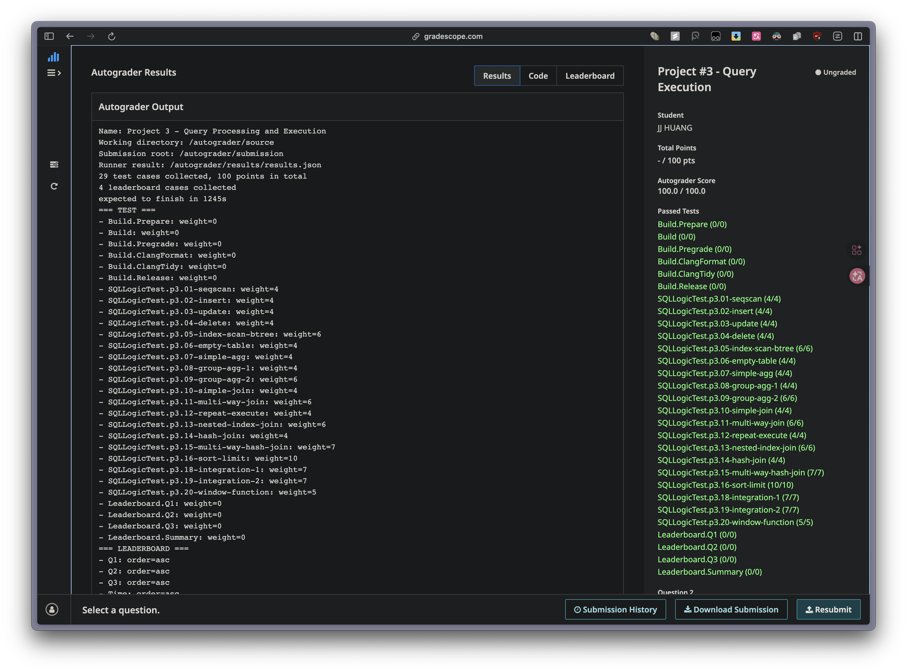

# Task #2 - Aggregation & Join Executors

## Plan vs Executor

**Plan**: Describes what operation to perform (join, scan, aggregate...) and its parameters (which index, join condition, LEFT vs INNER join)

**Executor**: Actually executes the plan and processes tuple reading, combining, and output

## AggregationExecutor

### SimpleAggregationHashTable (aht)
**Key Components**:
- `std::unordered_map<AggregateKey, AggregateValue>` - Maps group-by keys to aggregate values
  - AggregateKey: Contains `std::vector<Value>` from GroupBy expressions
  - AggregateValue: Contains `std::vector<Value>` from Aggregate expressions
- `GenerateInitialAggregateValue()`: Generates initial values (COUNT(*)=0, others=NULL)

### Core Concepts
- **Pipeline Breaker**: Init() calls child executor's Init() and Next() to build hash table
- `InsertCombine()` takes AggregateKey (GroupBy Expr) and AggregateValue (Aggregate Expr)
- COUNT(*) counts all rows, COUNT(colA) only counts non-NULL rows

### Key Points
**Q: Why is AggregateValue a vector?**
A: One query can have multiple aggregate functions (e.g., `SELECT MIN(colA), MAX(colB), COUNT(*)`), each group needs to track multiple results.

**Q: Are values in the hash table continuously updating?**
A: No. When Next() is called, Init() has already completed all aggregation. Hash table stores **final results**, Next() just iterates and outputs.

### Execution Flow
1. **Constructor**: Initialize `aht_` and `aht_iterator_` (use initializer list)
2. **Init()**: Build hash table (pipeline breaker)
   - Call `child_executor_->Init()`
   - Clear hash table
   - Loop through all child tuples, use `MakeAggregateKey()` and `MakeAggregateValue()`
   - Call `aht_.InsertCombine(key, value)` to insert and update
   - **Edge case**: If hash table is empty and no GROUP BY, insert initial value (COUNT(*)=0)
   - Set `aht_iterator_ = aht_.Begin()`
3. **Next()**: Output results
   - Iterate through hash table using `aht_iterator_`
   - Combine output tuple: `[group_by_values..., aggregate_values...]`
   - Use `GetOutputSchema()` to construct Tuple

### CombineAggregateValues Logic

| AggregationType | NULL input | result is NULL | Normal case |
|-----------------|------------|----------------|-------------|
| CountStar | Ignore, +1 | N/A (initial=0) | +1 |
| Count | Skip | result = 1 | +1 |
| Sum | Skip | result = input | result += input |
| Min | Skip | result = input | Take smaller |
| Max | Skip | result = input | Take larger |

### Common Mistakes

**1. Infinite loop in test**
- Cause: Didn't clear `child_tuples` in Init()'s while loop
- Solution: Add `child_tuples.clear()` and `child_rids.clear()` at end of loop

**2. Empty table COUNT(*) returns 1 instead of 0**
- Cause: Using `InsertCombine` for edge case, which calls `CombineAggregateValues` causing +1
- Solution: Add `InsertInitial()` method to directly insert initial value without combining

**3. Queries with arithmetic expressions crash (SEGV)**
- Symptom: `select min(v1) + sum(v2) from t1` crashes
- Cause: Planner adds ProjectionExecutor for arithmetic expressions. Projection assumes `tuple_batch` and `rid_batch` have same size, but AggregationExecutor doesn't fill rid_batch
- Solution: Add dummy RID in Next(): `rid_batch->emplace_back()`

**4. aht_iterator_ initialization order**
- Cause: Setting `aht_iterator_ = aht_.Begin()` before handling edge case
- Solution: Handle edge case **before** setting iterator

**5. AggregateKey::operator== modification**
- In SQL, `NULL = NULL` is false, but in GROUP BY, two NULLs should be treated as same
- Need special handling: if both sides are NULL, treat as equal

## NestedLoopJoinExecutor

### Execution Flow
1. **Constructor**: Initialize executors, check join type (only support INNER/LEFT)
2. **Init()**: Reset state
   - Set `left_idx_ = 0; right_idx_ = 0; matched_ = false`
   - Call `left_executor_->Init()` and `right_executor_->Init()`
3. **Next()**: Nested loop logic
   - Outer loop: Iterate through left tuples
   - Inner loop: For each left tuple, iterate through all right tuples
   - When right tuples exhausted → Move to next left tuple, call `right_executor_->Init()` to reset
   - LEFT JOIN: If `matched_ == false`, emit `left_tuple + NULLs`

### Key APIs

| Purpose | API |
|---------|-----|
| Get predicate | `plan_->Predicate()` |
| Evaluate join condition | `predicate->EvaluateJoin(&left, left_schema, &right, right_schema)` |
| Check if matched | `value.GetAs<bool>()` |
| Get tuple value | `tuple.GetValue(&schema, col_idx)` |
| Get join type | `plan_->GetJoinType()` |

### Output Tuple Construction
- Combine all columns from left tuple + all columns from right tuple
- For LEFT JOIN with no match: left tuple + NULLs (use `ValueFactory::GetNullValueByType()`)

### Inner Join vs Left Outer Join

| Type | When no match |
|------|---------------|
| INNER | Don't output |
| LEFT | Output `left_tuple + NULLs` |

### Common Mistakes

**1. Child executor appends, not overwrites**
- Problem: `child_executor->Next(&tuples, ...)` uses `push_back` to **append** new tuples, doesn't overwrite
- Consequence: If not cleared, old tuples accumulate → heap-buffer-overflow
- Solution: Call `clear()` **before** calling `Next()`

**2. Init() doesn't clear tuple vectors**
- Problem: If `Init()` called multiple times (re-execution), old tuples remain
- Solution: Clear all vectors in `Init()`

**3. `continue` jumps to wrong loop level**
- Problem: In Step 2's while loop, after right exhausted, `left_idx_++` then `continue` returns to **Step 2's while** (not outer while)
- Consequence: If `left_idx_` out of bounds but `right_tuples_` empty, reloads right, then Step 3 accesses out-of-bounds `left_tuples_[left_idx_]`
- Solution: Use `break` to exit Step 2 when out of bounds, check before Step 3

### Why is Implementation Complex?

**Conceptually** (Pseudo-code) just 5 lines:
- For each left tuple, iterate right table
- If predicate matches, emit combined tuple
- For LEFT JOIN, emit left + nulls if no match

**Implementation faces three challenges:**

1. **Volcano Model (Iterator Model)**
   - Can't write simple for loops, executor is a **state machine**
   - `Next()` can pause (return) anytime, must precisely restore state on next call
   - Need to manually maintain state variables: `left_idx_`, `right_idx_`, `matched_`

2. **Vectorization (Batch Processing)**
   - For performance, BusTub uses batch processing
   - Original "nested loop" becomes "4-layer loop":
     - Left table batch loop
     - Each tuple in left batch loop
     - Right table batch loop
     - Each tuple in right batch loop
   - Must handle buffer (`std::vector<Tuple>`) reload logic when exhausted

3. **Streaming Data Processing**
   - Can't assume all right table data in memory, must read in batches
   - After processing one left tuple, need to reset right scanner (`right_executor_->Init()`)
   - Must be careful about state reset order in state machine

**Summary**: Code maps "conceptual nested loop" to "streaming processing model with buffers and state preservation". This is the difficulty and essence of database kernel development.

## NestedIndexJoinExecutor

### Difference from NestedLoopJoin

| Feature | NestedLoopJoin | NestedIndexJoin |
|---------|----------------|-----------------|
| Child executors | 2 (left table, right table) | 1 (only outer table) |
| Inner table access | Scan entire right table | Index lookup |
| Time complexity | O(n × m) | O(n × log m) |

### Key APIs

| Purpose | API |
|---------|-----|
| Get key expression | `plan_->KeyPredicate()` |
| Inner table OID | `plan_->GetInnerTableOid()` |
| Index OID | `plan_->GetIndexOid()` |
| Inner table schema | `plan_->InnerTableSchema()` |

### Schema Sources

| Table | Access Method | Schema Source |
|-------|---------------|---------------|
| Outer (t1) | Scan via child executor | `child_executor_->GetOutputSchema()` |
| Inner (t2) | Index point lookup, **no executor** | `plan_->InnerTableSchema()` |

**Design Reason**: Outer table has corresponding executor (usually SeqScan), executor knows its output schema. Inner table accessed directly via index to table heap, no executor, so schema must be stored separately in plan node.

### Core Flow (for each outer tuple)
1. Extract join key value from outer tuple: `key_predicate->Evaluate(&outer_tuple, outer_schema)`
2. Construct Tuple for index query using the value and index key schema
3. Use index to query matching RIDs: `index->ScanKey(key, &rids, txn)`
4. Get inner tuple from table heap using RID: `table_heap->GetTuple(rid)`
5. Combine output tuple: outer tuple values + inner tuple values

### ScanKey Characteristics
- Return type is `void`, results passed via parameter `std::vector<RID> *result`
- May return 0, 1, or multiple RIDs (depending on data)
- Returns RID (tuple location), not tuple itself

### Evaluate vs EvaluateJoin

| Method | Use Case |
|--------|----------|
| `Evaluate(tuple, schema)` | Only one tuple (e.g., NestedIndexJoin key extraction) |
| `EvaluateJoin(left, left_schema, right, right_schema)` | Two tuples (e.g., NestedLoopJoin predicate evaluation) |

### LEFT JOIN Handling
- INNER JOIN: Index finds no match → Don't output
- LEFT JOIN: Index finds no match → Output `outer_tuple + NULLs`

## HashJoin Executor
- Uses right table for build, left table for probe. When iterating left table, naturally handles Left Outer Join cases, making implementation more intuitive.

## C++ Notes
- **Initializer list**: Directly "constructs" member variables with given parameters
- **Constructor body**: Member variables already "default constructed", body does "assignment"
  - If iterator has no default constructor, putting in body causes compiler to try default construction (fails)
  - Initializer list directly constructs with given value, skipping default constructor
- Use `.get()` to get raw pointer from unique_ptr

---

# Task #2 - Aggregation & Join Executors

## Plan vs Executor

**Plan**：描述要做什麼操作（join、scan、aggregate...）和操作的參數（用哪個 index、join 條件是什麼、是 LEFT 還是 INNER join）

**Executor**：實際執行這個 plan，處理 tuple 的讀取、組合、輸出

## AggregationExecutor

### SimpleAggregationHashTable (aht)
**核心組成**：
- `std::unordered_map<AggregateKey, AggregateValue>` - 將 group-by keys 映射到 aggregate values
  - AggregateKey: 包含來自 GroupBy expressions 的 `std::vector<Value>`
  - AggregateValue: 包含來自 Aggregate expressions 的 `std::vector<Value>`
- `GenerateInitialAggregateValue()`: 產生初始值（COUNT(*)=0, 其他=NULL）

### 核心概念
- **Pipeline Breaker**: Init() 呼叫 child executor 的 Init() 和 Next() 來建構 hash table
- `InsertCombine()` 接收 AggregateKey (GroupBy Expr) 和 AggregateValue (Aggregate Expr)
- COUNT(*) 計算所有 row，COUNT(colA) 只計算 Not Null 的 row 的個數

### 關鍵要點
**Q: 為什麼 AggregateValue 是一個 vector？**
A: 因為一個 SQL 查詢可能有多個聚合函數（例如 `SELECT MIN(colA), MAX(colB), COUNT(*)`），每個 group 需要同時追蹤多個聚合結果。

**Q: values 裡存的是「一直在更新」的 aggregates 嗎？**
A: 不是。當 Next() 被呼叫時，Init() 已經完成所有聚合計算。hash table 裡存的是**最終結果**，Next() 只是遍歷並輸出。

### 執行流程
1. **Constructor**: 初始化 `aht_` 和 `aht_iterator_`（用 initializer list）
2. **Init()**: 建構 hash table（pipeline breaker）
   - 呼叫 `child_executor_->Init()`
   - 清空 hash table
   - 迴圈取得所有 child tuples，用 `MakeAggregateKey()` 和 `MakeAggregateValue()`
   - 呼叫 `aht_.InsertCombine(key, value)` 插入並更新
   - **Edge case**: 若 hash table 為空且沒有 GROUP BY，插入一筆初始值（COUNT(*)=0）
   - 設定 `aht_iterator_ = aht_.Begin()`
3. **Next()**: 輸出結果
   - 遍歷 hash table（用 `aht_iterator_`）
   - 組合 output tuple：`[group_by_values..., aggregate_values...]`
   - 用 `GetOutputSchema()` 建構 Tuple

### CombineAggregateValues 邏輯

| AggregationType | NULL input | result 是 NULL | 一般情況 |
|-----------------|------------|----------------|----------|
| CountStar | 不管，+1 | N/A（初始=0）| +1 |
| Count | 跳過 | result = 1 | +1 |
| Sum | 跳過 | result = input | result += input |
| Min | 跳過 | result = input | 取較小值 |
| Max | 跳過 | result = input | 取較大值 |

### 常見錯誤

**1. 測試卡住（無限迴圈）**
- 原因：Init() 的 while 迴圈中沒有清空 `child_tuples`
- 解決：在迴圈結尾加上 `child_tuples.clear()` 和 `child_rids.clear()`

**2. 空表 COUNT(*) 回傳 1 而非 0**
- 原因：使用 `InsertCombine` 處理 edge case，它會呼叫 `CombineAggregateValues` 導致 +1
- 解決：新增 `InsertInitial()` 方法，直接插入初始值而不 combine

**3. 有 arithmetic expression 的查詢 crash（SEGV）**
- 現象：`select min(v1) + sum(v2) from t1` crash
- 原因：Planner 會加上 ProjectionExecutor。Projection 假設 `tuple_batch` 和 `rid_batch` 大小相同，但 AggregationExecutor 沒有填入 rid_batch
- 解決：在 Next() 中加入 dummy RID：`rid_batch->emplace_back()`

**4. aht_iterator_ 初始化順序問題**
- 原因：在處理 edge case 之前就設定 `aht_iterator_ = aht_.Begin()`
- 解決：edge case 處理要在設定 iterator **之前**

**5. AggregateKey::operator== 修改**
- SQL 中 `NULL = NULL` 是 false，但 GROUP BY 中兩個 NULL 應視為相同
- 需特別處理：若兩邊都是 NULL，視為相等

## NestedLoopJoinExecutor

### 執行流程
1. **Constructor**: 初始化 executors，檢查 join type（只支援 INNER / LEFT）
2. **Init()**: 重置狀態
   - 設定 `left_idx_ = 0; right_idx_ = 0; matched_ = false`
   - 呼叫 `left_executor_->Init()` 和 `right_executor_->Init()`
3. **Next()**: Nested loop 邏輯
   - 外層迴圈：遍歷 left tuples
   - 內層迴圈：對每個 left tuple，遍歷所有 right tuples
   - 當 right tuples 用完 → 移到下一個 left tuple，呼叫 `right_executor_->Init()` 重置
   - LEFT JOIN：若 `matched_ == false`，emit `left_tuple + NULLs`

### 關鍵 API

| 用途 | API |
|------|-----|
| 取得 predicate | `plan_->Predicate()` |
| 評估 join 條件 | `predicate->EvaluateJoin(&left, left_schema, &right, right_schema)` |
| 判斷是否匹配 | `value.GetAs<bool>()` |
| 取得 tuple 的值 | `tuple.GetValue(&schema, col_idx)` |
| 取得 join type | `plan_->GetJoinType()` |

### Output Tuple 建構
- 組合 left tuple 的所有 columns + right tuple 的所有 columns
- LEFT JOIN 無匹配時：left tuple + NULLs（用 `ValueFactory::GetNullValueByType()`）

### Inner Join vs Left Outer Join

| 類型 | 無匹配時 |
|------|----------|
| INNER | 不輸出 |
| LEFT | 輸出 `left_tuple + NULLs` |

### 常見錯誤

**1. Child executor 是 append，不是覆蓋**
- 問題：`child_executor->Next(&tuples, ...)` 用 `push_back` 將新 tuples **append** 到 vector，不是覆蓋
- 後果：若不清空 vector，舊 tuples 會累積 → heap-buffer-overflow
- 解決：在呼叫 `Next()` **之前**先 `clear()`

**2. Init() 沒有清空 tuples vector**
- 問題：若 `Init()` 被多次呼叫（re-execution），舊的 tuples 還在 vector 中
- 解決：在 `Init()` 中清空所有 vectors

**3. `continue` 跳到錯誤的迴圈層級**
- 問題：在 Step 2 的 while 迴圈中，當 right 用完後執行 `left_idx_++` 再 `continue`，會回到 **Step 2 的 while**（不是外層 while）
- 後果：若 `left_idx_` 已越界，會存取越界的 `left_tuples_[left_idx_]`
- 解決：越界時用 `break` 跳出 Step 2，並在 Step 3 前檢查

### 為什麼實作很複雜？

**概念上**（Pseudo-code）只要 5 行：
- 對每個 left tuple，遍歷 right table
- 若 predicate 匹配，emit 組合的 tuple
- 對 LEFT JOIN，若無匹配則 emit left + nulls

**實作面對三個挑戰：**

1. **火山模型（Volcano Model / Iterator Model）**
   - 不能寫簡單的 for 迴圈，執行器是**狀態機**
   - `Next()` 隨時會暫停（return），下次被呼叫時必須精確恢復到上次停下的地方
   - 需要手動維護 `left_idx_`、`right_idx_`、`matched_` 等狀態變數

2. **向量化執行（Vectorization / Batch Processing）**
   - 為了效能，BusTub 改用批次處理
   - 原本的「雙層迴圈」變成「四層迴圈」結構：
     - 左表的一批（Batch Loop）
     - 左表這批裡的每一個（Tuple Loop）
     - 右表的一批（Batch Loop）
     - 右表這批裡的每一個（Tuple Loop）
   - 必須處理緩衝區（`std::vector<Tuple>`）耗盡時的重新加載邏輯

3. **流式數據處理**
   - 不能假設右表的所有數據都在內存裡，必須按批次讀取
   - 當左表的一個 Tuple 處理完後，需要重置右表的掃描器（`right_executor_->Init()`）
   - 在狀態機中需要小心狀態的重置順序

**總結**：程式碼就是把「概念上的雙層迴圈」映射到「帶有緩衝區和狀態保存的流式處理」模型上。這正是資料庫內核開發的困難與精髓所在。

## NestedIndexJoinExecutor

### 與 NestedLoopJoin 的差異

| 特性 | NestedLoopJoin | NestedIndexJoin |
|------|----------------|-----------------|
| 子執行器數量 | 2 個（左表、右表）| 1 個（只有外部表格）|
| 內部表格存取方式 | 掃描整個右表 | 透過索引查詢 |
| 時間複雜度 | O(n × m) | O(n × log m) |

### 關鍵 API

| 用途 | API |
|------|-----|
| 取得 key 表達式 | `plan_->KeyPredicate()` |
| 內部表格 OID | `plan_->GetInnerTableOid()` |
| 索引 OID | `plan_->GetIndexOid()` |
| 內部表格 schema | `plan_->InnerTableSchema()` |

### Schema 來源

| 表格 | 存取方式 | Schema 來源 |
|------|----------|-------------|
| Outer (t1) | 透過 child executor 掃描 | `child_executor_->GetOutputSchema()` |
| Inner (t2) | 透過索引點查，**沒有 executor** | `plan_->InnerTableSchema()` |

**設計原因**：Outer 表有對應的 executor（通常是 SeqScan），executor 本身就知道自己輸出的 schema。Inner 表則是透過索引直接存取 table heap，沒有 executor，所以 schema 必須另外儲存在 plan node 中。

### 核心流程（對每個外部 tuple）
1. 從外部 tuple 提取 join key 值：`key_predicate->Evaluate(&outer_tuple, outer_schema)`
2. 用該值和 index key schema 構造索引查詢用的 Tuple
3. 用索引查詢匹配的 RID：`index->ScanKey(key, &rids, txn)`
4. 用 RID 從 table heap 取得內部 tuple：`table_heap->GetTuple(rid)`
5. 組合輸出 tuple：outer tuple 的值 + inner tuple 的值

### ScanKey 的特性
- 回傳型別是 `void`，結果透過參數 `std::vector<RID> *result` 傳出
- 可能回傳 0 個、1 個或多個 RID（視資料而定）
- 回傳的是 RID（tuple 的位置），不是 tuple 本身

### Evaluate vs EvaluateJoin

| 方法 | 使用情境 |
|------|----------|
| `Evaluate(tuple, schema)` | 只有一個 tuple（如 NestedIndexJoin 的 key 提取）|
| `EvaluateJoin(left, left_schema, right, right_schema)` | 有兩個 tuple（如 NestedLoopJoin 的 predicate 評估）|

### LEFT JOIN 處理
- INNER JOIN：索引查不到匹配 → 不輸出
- LEFT JOIN：索引查不到匹配 → 輸出 `outer_tuple + NULLs`

## HashJoin Executor
- 用右表 build、左表 probe 的方式，在遍歷左表時就能自然地處理 Left Outer Join 的情況，實作上更直觀

## C++ 筆記
- **Initializer list**：直接用給定的參數「建構」成員變數
- **Constructor body**：成員變數已經被「預設建構」了，在 body 裡做的是「賦值」
  - 若 iterator 沒有 default constructor，放在 body 裡會導致編譯器嘗試 default construction（失敗）
  - 放在 initializer list 就是直接用給定值建構，跳過 default constructor
- 用 `.get()` 從 unique_ptr 取得原始指標
